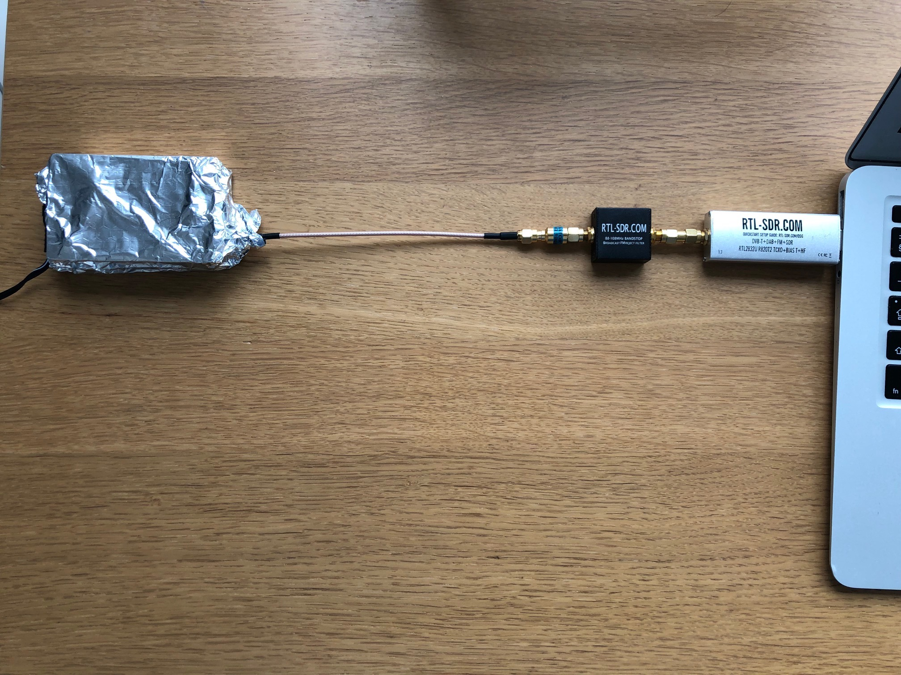
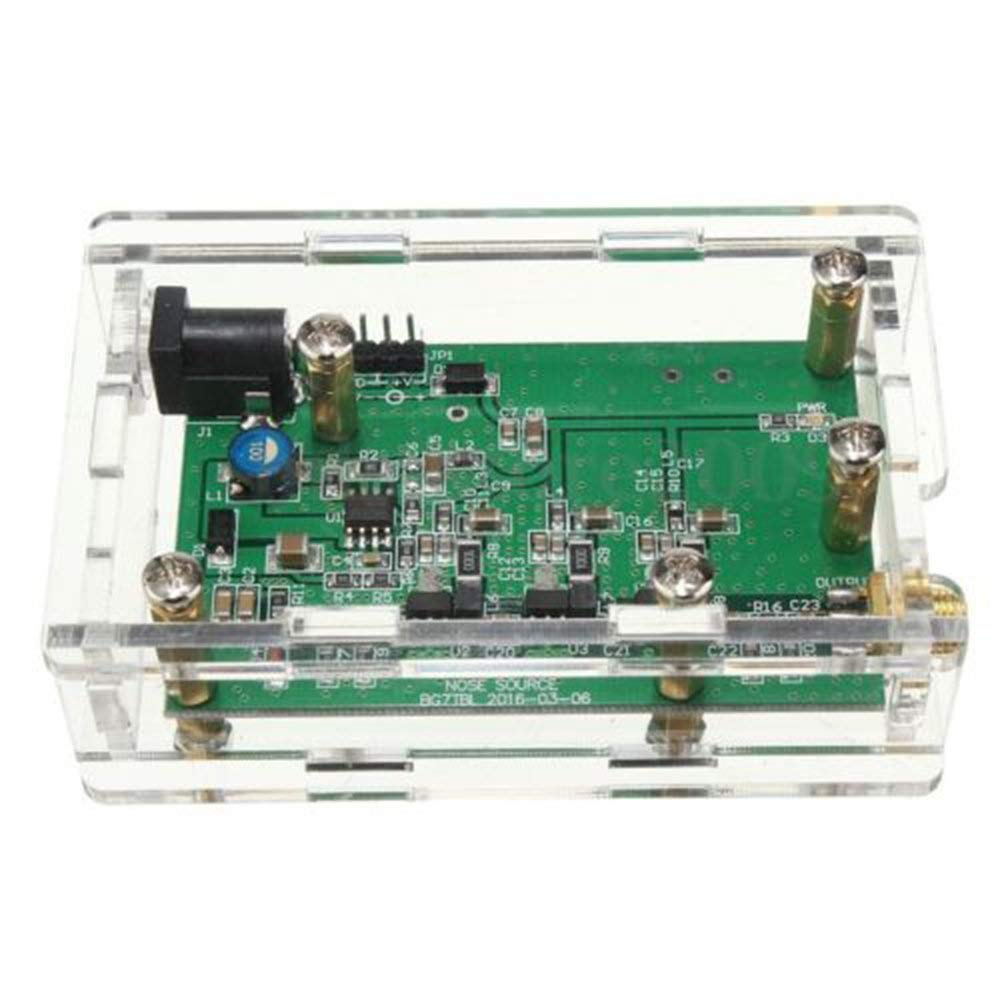
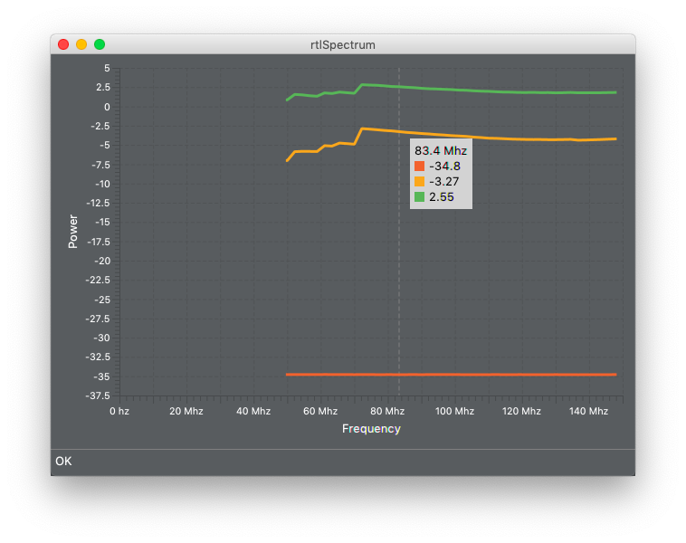
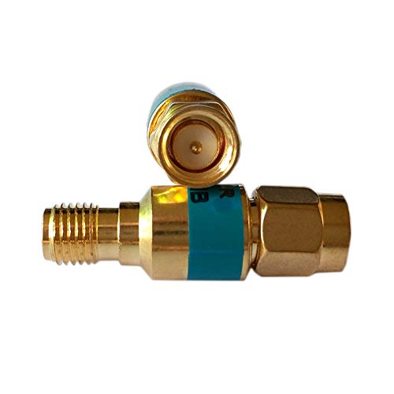
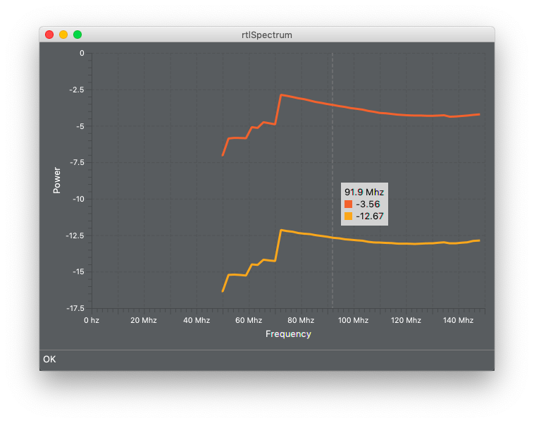
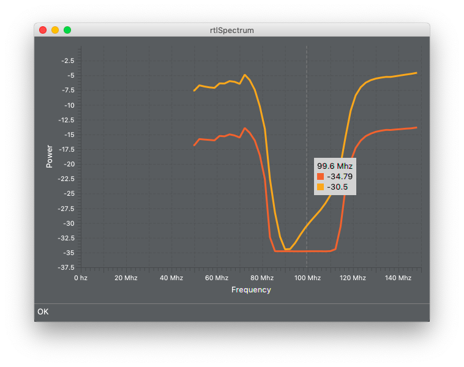
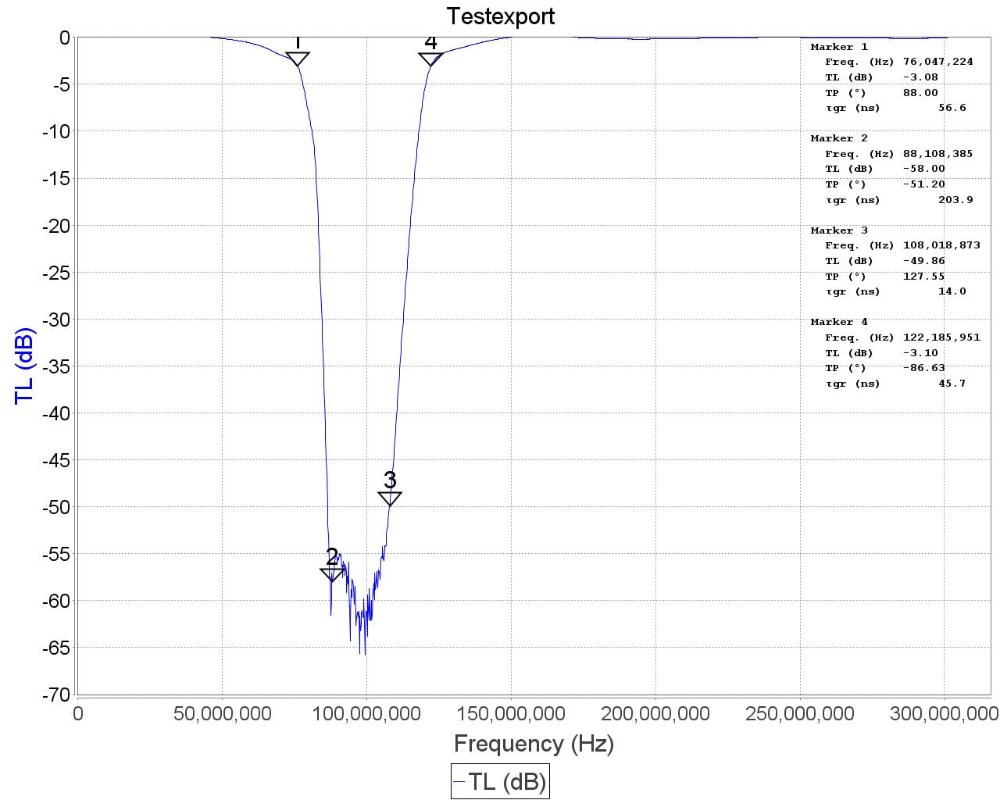
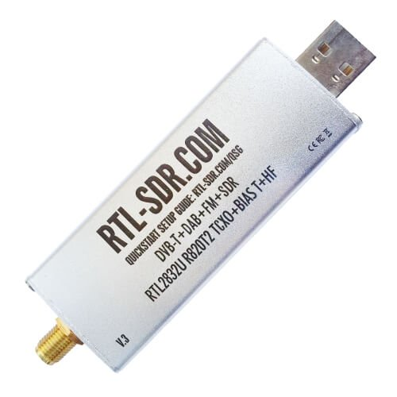
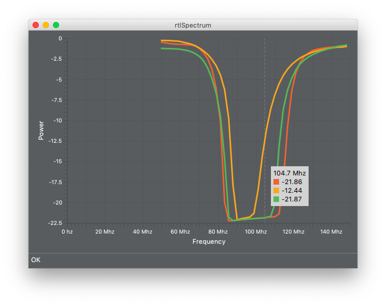

TL;TR; Фильтры тестировать можно, но выводы нужно делать аккуратно.

## Постановка задачи

Архитектура rtl sdr требует специального фильтра на входе. Поскольку сильнейшими источниками сигнала являются фм станции, то я решил поставить фм фильтры на входе приёмника. Но прежде, чем устанавливать их, мне хотелось измерить частотные характеристики фильтров и пощупать их в деле. Для этого я купил несколько фм фильтров и собрал стенд для их тестирования.

## Описание стенда

Тестирование заключается в том, что генератор сигнала создаёт широкополосный шум по всей ширине спектра. Фильтр отфильтровывает только часть. Разница между сигналом с фильтром и без, и есть характеристика фильтра. Вот как выглядит мой стенд:



### Софт

rtl_power - программа из стандартной поставки [rtl-sdr](https://github.com/osmocom/rtl-sdr). Она позволяет сканировать большой диапазон частот, разбивая его участки примерно 2Mhz и выполняя быстрое преобразование фурье. После этого, результаты преобразуются в dbm. Все измерения производились с помощью одних и тех же настроек:

```bash
rtl_power -f 50M:150M:100k -g 0 -c 20% -i 2m -1
```

[rtlSpectrum](http://github.com/dernasherbrezon/rtlSpectrum) - небольшая программа для удобного отображения результатов и сравнения нескольких графиков.

### Генератор сигнала



Достаточно дешёвый и хороший генератор широкополосного сигнала. В описании сказано, что он должен работать от напряжения 12В. На практике же, это слишком большое напряжение для rtl-sdr, поэтому [согласно рекомендациям](http://blog.radiospy.ru/testy/achx-metr-iz-svistka.html#more-1452) я подключил его к источнику питания 5В. Для сравнения я измерил его частотную характеристику на 5В и 12В:



На картинке зелёный график - это 12В, жёлтый - 5В, оранжевый - без генератора. Как видно, разница между 5В и 12В составляет примерно 5дб.

### Аттенюатор



[Аттенюатор](https://ru.wikipedia.org/wiki/Аттенюатор) - это устройство для плавного понижения электромагнитных колебаний. Как в дальнейшем показали опыты, он крайне необходим, чтобы получить более или менее хорошие результаты. Я использовал аттенюатор -10db. Вот пример понижения частот в ФМ диапазоне:



Видно, что снижение мощности происходит на 9дб, что почти является заявленными 10дб. 

Когда я начал тестировать фильтры, выяснилось, что снижение напряжения на генераторе до 5В недостаточно. Вот небольшое сравнение характеристики фильтра с аттенюатором и без:



По своим характеристикам фильтр должен давать уменьшение мощности на -60дб. Однако, судя по графику, он даёт только -30дб. При работе аттенюатора появляется более явный результат фильтрации. Однако, минимальное значение по-прежнему -35дб. Этот эффект называется "перегрузка". Мощность входного сигнала слишком большая, поэтому [динамического диапазона]() rtl-sdr не хватает и нижняя часть графика обрезается. Вот пример измерения того же фильтра на профессиональном оборудовании:



### ФМ фильтры

В тесте участвовали следующие фильтры:

- [rtl-sdr.com FM reject filter](https://www.rtl-sdr.com/rtl-sdr-com-broadcast-fm-band-stop-filter-88-108-mhz-reject-now-for-sale/)
- [gpio labs](https://www.ebay.com/itm/FM-Notch-Filter-88-108MHz-Excellent-Rejection-85dB-Bandstop-9th-order-FM-Trap/282342066492?hash=item41bce6093c:g:O2MAAOSw-0xYTW3W)
- [Distill FM](https://www.amazon.co.uk/NooElec-Distill-Barebones-Broadcast-Applications/dp/B076D354LW) от NooElec

### rtl-sdr приёмник



В качестве rtl-sdr приемника я использовал [rtl-sdr.com](https://www.amazon.com/dp/B0129EBDS2/ref=as_li_ss_tl?ie=UTF8&linkCode=sl1&tag=rsv0f-20&linkId=9806dfa291f74f7cdb49e2cfbe3d34eb). У него хорошие характеристики и удобный SMA коннектор.

## Результаты теста



Где:

 - жёлтый - Distill FM. [Данные](img/nooelec_diff.csv)
 - зелёный - gpio labs. [Данные](img/gpio_diff.csv)
 - оранжевый - rtl-sdr.com FM reject filter. [Данные](img/rtlsdrcom_diff.csv)

По ссылкам можно скачать результат для каждого фильтра, загрузить в [rtlSpectrum](http://github.com/dernasherbrezon/rtlSpectrum) и сравнить их на разных частотах.

Выводы:

 - фильтры соответствуют заявленным характеристикам. По крайней мере на столько, на сколько позволяет судить стенд.
 - с помощью rtl-sdr и rtl_power можно измерять характеристики фильтров, но делать это нужно очень аккуратно.


