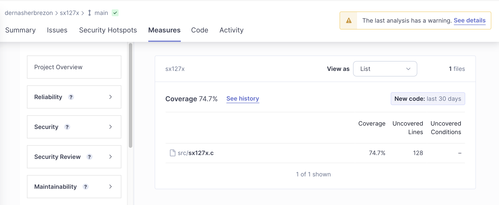

Я продолжаю разрабатывать библиотеку для работы с чипом [sx127x](https://github.com/dernasherbrezon/sx127x), и в этом посте речь пойдёт о тестировании. Но для начала небольшая предыстория. Изначально библиотека поддерживала только LoRa модуляцию и была достаточно небольшой. По сути это была небольшая обёртка над регистрами sx127x, которая позволяла из Си вызывать нужные функции. Основная ценность скорее была в том, чтобы перевести магические числа и SPI протокол в понятные слова из даташита. После того как я решил добавить поддержку FSK модуляции, библиотека разрослась. Нужно было поддержать потоковую обработку входящих сообщений, реагировать на гораздо большее количество прерываний и при этом не сломать старый функционал. В этот момент стало понятно, что нужны тесты.

## Юнит тесты

Из-за того, что библиотека не зависит от конкретных плат и операционных систем, писать юнит тесты оказалось просто. Достаточно сделать mock-реализацию SPI интерфейса и возвращать ожидаемые данные. Например, регистры sx127x можно эмулировать следующим образом:

```c
void spi_mock_registers(uint8_t *expected, int code) {
  sx127x_mock_registers = expected;
  sx127x_mock_expected_code = code;
}
```

А в реализации использовать их вот так:

```c
#include <sx127x_spi.h>

int sx127x_spi_read_registers(int reg, void *spi_device, size_t data_length, uint32_t *result) {
  for (int i = 0; i < data_length; i++) {
    *result = ((*result) << 8);
    *result = (*result) + sx127x_mock_registers[reg + i];
  }
}
```

Единственное, что нужно учитывать - это специальный регистр 0x00 (FIFO), чтение и запись в который должна работать по-другому. Полную реализацию [mock SPI](https://github.com/dernasherbrezon/sx127x/blob/main/test/sx127x_mock_spi.c) можно посмотреть в репозитории.

Для юнит тестов я использовал библиотеку [libcheck](https://libcheck.github.io/check/), потому что другие мои проекты [sdr-server](https://github.com/dernasherbrezon/sdr-server) и [sdr-modem](https://github.com/dernasherbrezon/sdr-modem) тоже её используют. Как и любая другая библиотека эта позволяет инициализировать состояние перед каждым тестом:

```c
void setup() {
  registers = (uint8_t *)malloc(registers_length * sizeof(uint8_t));
  memset(registers, 0, registers_length);
  registers[0x42] = 0x12;
  spi_mock_registers(registers, SX127X_OK);
  ck_assert_int_eq(SX127X_OK, sx127x_create(NULL, &device));
  spi_mock_write(SX127X_OK);
}
```

Вызывает тест. Например, тест обработчика CAD прерывания выглядит так:

```c
START_TEST(test_lora_cad) {
  ck_assert_int_eq(SX127X_OK, sx127x_set_opmod(SX127x_MODE_CAD, SX127x_MODULATION_LORA, device));
  ck_assert_int_eq(registers[0x40], 0b10000000);
  sx127x_lora_cad_set_callback(cad_callback, device);
  registers[0x12] = 0b00000101;  // cad detected
  sx127x_handle_interrupt(device);
  ck_assert_int_eq(1, cad_status);

  registers[0x12] = 0b00000100;  // cad not detected
  sx127x_handle_interrupt(device);
  ck_assert_int_eq(0, cad_status);
}
END_TEST
```

И очищать состояние после каждого теста с помощью функции ```teardown()```:

```c
void teardown() {
  if (device != NULL) {
    sx127x_destroy(device);
    device = NULL;
  }
  if (registers != NULL) {
    free(registers);
    registers = NULL;
  }
}
```

В итоге мне удалось написать порядочное количество тестов и добиться [74.7% покрытия тестами](https://sonarcloud.io/component_measures?id=dernasherbrezon_sx127x&metric=coverage&view=list).



Вообще, несмотря на кажущуюся простоту решения, мне удалось найти несколько довольно досадных ошибок! В основном связанных с тем, что я где-то неправильно сдвигал биты или выставлял не те регистры. Так что время потраченное на написание юнит тестов и их настройку полностью себя оправдало.

## Интеграционные тесты

Юнит тесты всем хороши. Но как понять, что выставленные биты в правильном регистре действительно позволяют отправлять и получать сообщения? На помощь приходят интеграционные тесты. Если бы меня спросили: "А как написать интеграционные тесты для Java проекта?", то я бы без запинки ответил, что-нибудь про докер, среду тестирования или [mock HTTP сервер](). Когда же встал вопрос о том, как протестировать железо, то мне потребовалось несколько недель, чтобы разобраться с проблемой.

Изначально я взял ESP-IDF в котором есть поддержка [интеграционных](https://docs.espressif.com/projects/esp-idf/en/latest/esp32/contribute/esp-idf-tests-with-pytest.html) тестов. Они построены на основе pytest и скорее ориентированы на тестирования фреймворка, чем сторонних приложений.



Фреймворк предлагает реализовывать тесты следующим образом:

 1. Создать отдельное приложение на Си с тестовыми сценариями
 2. Использовать [pytest](https://docs.pytest.org/en/7.3.x/) + [pytest-embedded](https://docs.espressif.com/projects/pytest-embedded/en/latest/) для того, чтобы запускать сценарии в нужной последовательности

После нескольких лет эксплуатации я понял, что эта связка крайне нестабильна. 

Во-первых, нужен Python и определённые зависимости. 

Во-вторых, нужно скопировать pytest.ini из фреймворка в проект. При каждом обновлении версии ESP-IDF, pytest.ini ломался. 

В-третьих, нужна дополнительная конфигурация приложения в  ```sdkconfig.defaults```:

```
CONFIG_ESP_TASK_WDT=n
```

В-четвёртых, магия Python. Тесты хоть и работают, но непонятно как. Что такое ```supported_targets``` и почему мне нужно их указывать? Откуда приходят ```Dut``` и какие методы там есть? Почему для запуска тестов нужно указывать ```export ESPBAUD=460800```?

```python
@pytest.mark.supported_targets
@pytest.mark.generic
@pytest.mark.parametrize('count', [
    2,
], indirect=True)
def test_single(dut: Tuple[Dut, Dut]) -> None:
    dut_rx = dut[0]
    dut_tx = dut[1]

    dut_rx.expect('Press ENTER to see the list of tests')
    dut_rx.write('"sx127x_test_lora_rx_explicit_header"')

    dut_tx.expect('Press ENTER to see the list of tests')
    dut_tx.write('"sx127x_test_lora_tx_explicit_header"')
    dut_tx.expect_unity_test_output()

    dut_rx.expect_unity_test_output()
```

В итоге я переписал всё на Java + Junit + Maven:



Главным отличием от предыдущего подхода стало управление чипом через более мелкие AT команды вместо запуска сценариев. Это позволило перенести все сценарии в Java код и написать гораздо больше тестов, без необходимости перепрошивать устройство каждый раз.

```java
@Test
public void testExplicitHeader() {
	rx.sx127x_set_opmod(new OpMode(sx127x_mode_t.SX127X_MODE_SLEEP, sx127x_modulation_t.SX127X_MODULATION_LORA));
	rx.sx127x_lora_set_implicit_header(null);
	rx.sx127x_lora_reset_fifo();
	rx.sx127x_set_opmod(new OpMode(sx127x_mode_t.SX127X_MODE_RX_CONT, sx127x_modulation_t.SX127X_MODULATION_LORA));

	tx.sx127x_set_opmod(new OpMode(sx127x_mode_t.SX127X_MODE_SLEEP, sx127x_modulation_t.SX127X_MODULATION_LORA));
	sx127x_tx_header_t txHeader = new sx127x_tx_header_t(true, sx127x_cr_t.SX127X_CR_4_5);
	tx.sx127x_lora_tx_set_explicit_header(txHeader);
	// it looks like some boards don't have RFO pin connected to the antenna
	tx.sx127x_tx_set_pa_config(new PaConfig(sx127x_pa_pin_t.SX127X_PA_PIN_BOOST, 4));
	tx.sx127x_lora_reset_fifo();
	tx.sx127x_lora_tx_set_for_transmission("CAFE");
	tx.tx(sx127x_modulation_t.SX127X_MODULATION_LORA);
	
	LoraTest.assertFrames(rx, "CAFE");
}
```

Также стоит отметить, что:

 * тесты перестали зависеть от фреймворка
 * больший контроль над стартом, остановкой и очисткой состояния. Мне удалось поймать несколько багов, которые делали предыдущие тесты нестабильными!
 * at_app можно использовать как самостоятельное приложение
 * скорость прохождения тестов увеличилась раза в 2-3

## Послесловие

Тестировать железо можно, но для этого нужно иметь много утилит и инструментов. ESP-IDF из коробки предоставляет хороший набор, который позволяет писать сложные тесты. Посмотрим, хватит ли его функционала для моих нужд. У меня в планах добавить тесты для LoRa, FSK, OOK, различные режимы отправки сообщений с контрольной суммой и без, а так же проверить потребление памяти.