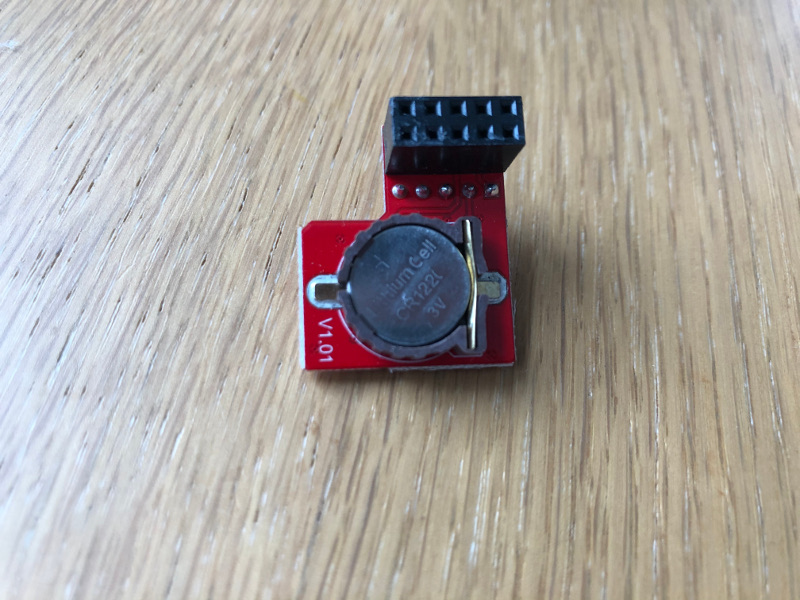

Прошёл почти год с момента написания [оригинальной статьи]() про время в Raspberrypi, и вот я уже снова столкнулся с этой проблемой. На этот раз мне захотелось сделать мобильную станцию слежения за спутниками вместе с [поворотным устройством](). Мобильность в данном случае означает то, что я могу принести станцию в поле, поймать несколько сигналов во время чтения книги, отнести домой и залить результаты в [https://leosatdata.com](https://leosatdata.com). Проблема оказалась там, где её никто не ждал. Если отнести Raspberrypi в чисто-поле, то там не будет сигнала Wi-Fi. А это значит, не будет сети. А это значит не будет NTP и неоткуда получить время. Можно, конечно, зайти удалённо на Raspberrypi и вручную выставить время по часам. Но это выглядит слишком утомительным. 

## RTC для RPi

Вместо того чтобы вручную устанавливать время, можно пойти более простым путём. Достаточно установить RTC модуль и время будет правильным всегда. Вернее, до тех пор, пока работает маленькая пальчиковая батарейка в этом модуле.

Я заказал модуль MakerHawk RPI DS1307.


На обратной стороне в него вставляется небольшая батарейка формата CR1220.



Весь модуль крепится на I2C контакты Raspberrypi.


У меня установлены стандартные радиаторы на процессор. Они не очень высокие, поэтому между ними и RTC модулем есть небольшой зазор. Однако, если ставить нестандартное охлаждение, например, кулер, то могут возникнуть проблемы. 

## Настройка Raspberrypi

После того как модуль установлен, необходимо настроить Raspberrypi. Это делается достаточно просто.

Во-первых, нужно подключить специальный модуль ядра. Для этого в файл ```/boot/config.txt``` нужно добавить следующие строчки:

```
device_tree=bcm2710-rpi-3-b.dtb
dtoverlay=i2c-rtc,ds1307
dtparam=i2c_arm=on
```

Во-вторых, необходимо выключить старую эмуляцию часов на основе файлов. Для этого нужно удалить и выключить ```fake-hwclock```:

```bash
sudo apt-get -y remove fake-hwclock
sudo update-rc.d -f fake-hwclock remove
```

Так же необходимо убрать проверку из ```/lib/udev/hwclock-set``` и закомментировать/удалить следующие строчки:

```
if [ -e /run/systemd/system ] ; then
 exit 0
fi
```

После этого, можно перезагружаться. Если всё прошло успешно, то в логах dmesg будут следующие строчки:

```
[    5.779005] rtc-ds1307 1-0068: registered as rtc0
```

Устройство подключено и работает. Теперь можно переходить к заключительному шагу: настройка времени. Необходимо установить системное время. 

```bash
sudo date -s '2020-06-10 18:30:00'
```

После чего нужно скопировать текущее системное время на RTC модуль:

```bash
sudo hwclock -w
date && sudo hwclock -r
```

Всё готово. Теперь Raspberrypi будет показывать актуальное время после каждого рестарта, даже если нет соединения с интернетом.