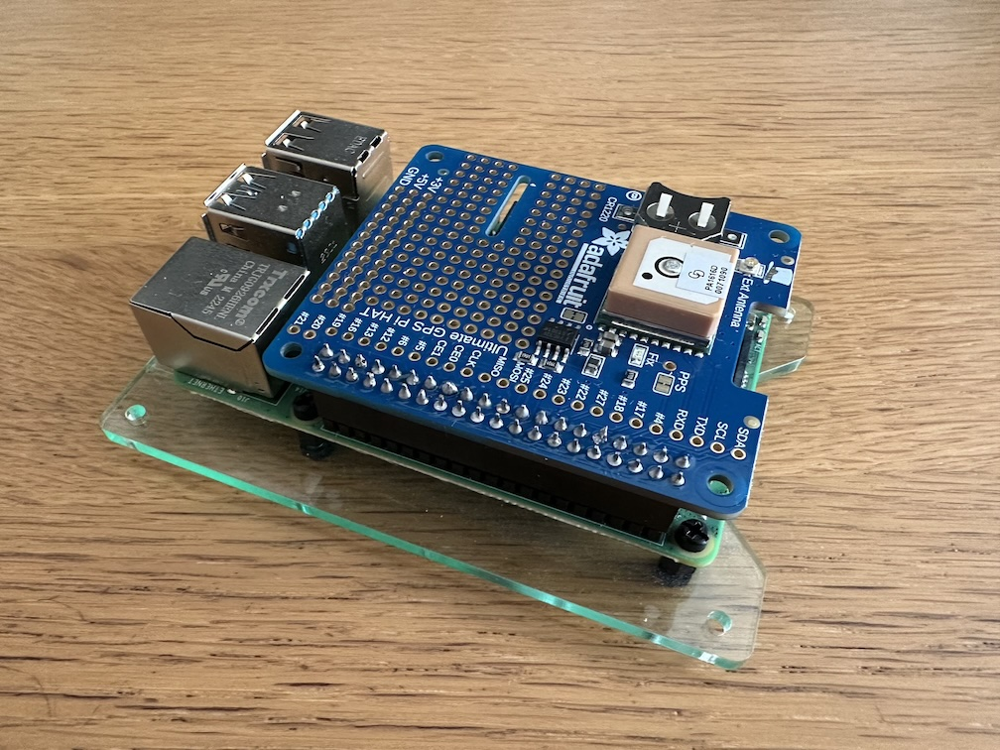
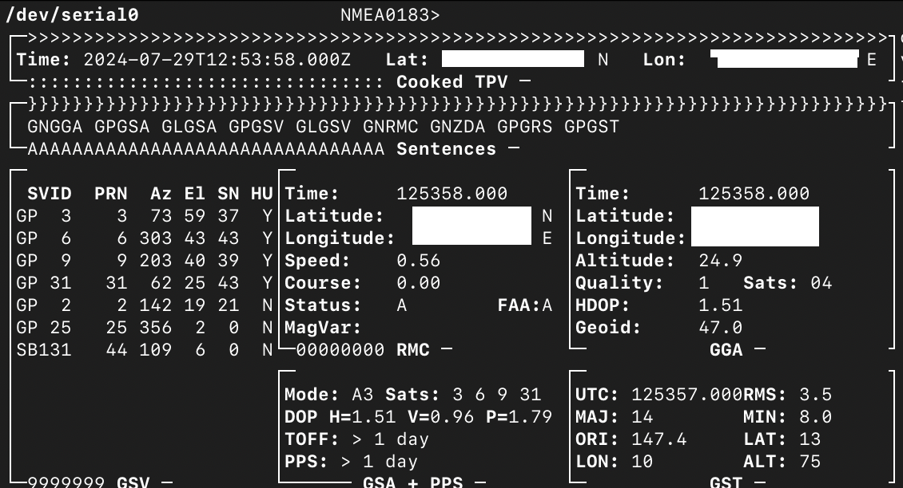
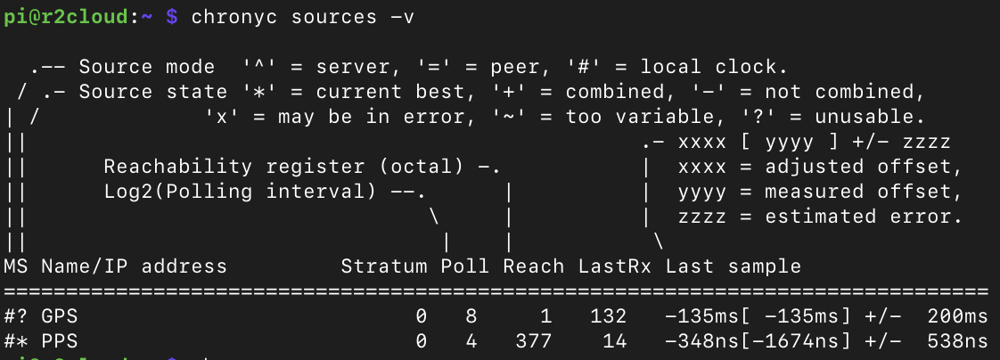
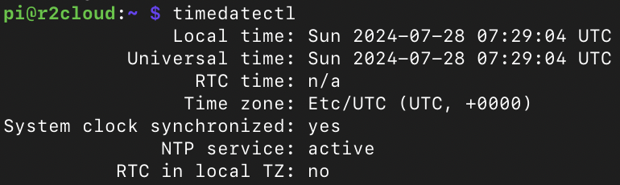
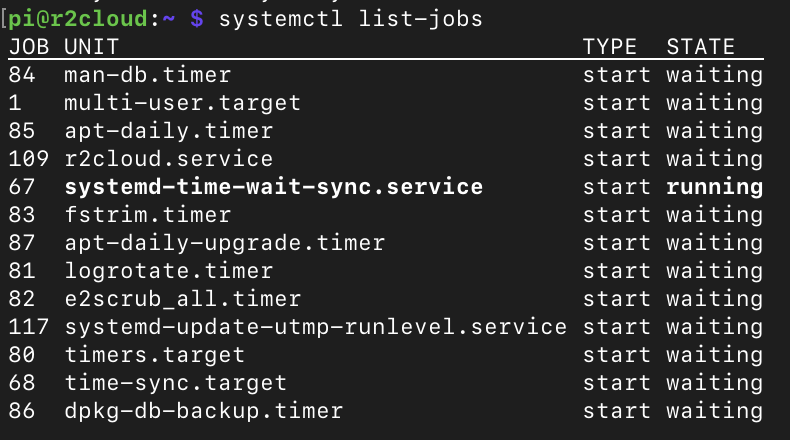

В одной из своих [прошлых статей]() я писал о том, что в RaspberryPI нет RTC, и к чему это может привести. Можно купить и установить [отдельный модуль](), чтобы решить эту проблему. Однако, как оказалось, и с этим подходом могут быть проблемы:

 * я где-то потерял его
 * нужна отдельная батарейка, за которой нужно следить и раз в несколько лет менять

Ещё одним решением может быть GPS модуль! С помощью него можно получать не только координаты, но и текущее время.

## GPS

GPS модуль идеально подходит для r2cloud по нескольким причинам. Во-первых, станция уже должна быть на улице, чтобы принимать сигналы. Во-вторых, время начальной синхронизации не критично - r2cloud просто стартует чуть позже. В-третьих, можно загружать координаты станции напрямую из GPS модуля. Это позволит сделать станцию чуть более мобильной.

В качестве GPS модуля я выбрал [Adafruit Ultimate GPS HAT for Raspberry Pi](). Но в теории может подойти абсолютно любой. Этот удобен тем, что достаточно крепко крепится к плате и ему не нужен отдельный провод.



Основная информация передаётся к текстовом виде по UART, а высокоточная синхронизация (PPS) через пин №4. Мне такая точность не особенно нужна, да и процессор RaspberryPI не может быстро обрабатывать такой сигнал, но почему бы и нет?

Интересный факт: для того, чтобы повысить точность часов, нужно уменьшить задержки между получением сигнала со спутника и выставлением времени в Linux. Ни UART, ни даже USB здесь не подходят - слишком медленно. Для этого используется отдельный провод: если напряжение на нём выростает от 0В до 3.3В, то значит началась новая секунда.

## Конфигурация

Для работы нужно сконфигурировать несколько сервисов.



### RaspberryPI

Поскольку чип общается с RaspberryPI по UART, то нужно отключить поддержку логина через UART. Это кстати не самая лучшая идея, потому что в поле хотелось бы иметь запасной план. Однако, я не нашёл плат, которые бы работали по I2C или SPI.

Для начала нужно запустить стандартную утилиту:

```
sudo raspi-config
```

Потом выбрать пункт: "Interface Options" -> "Serial Port".

На вопрос "нужно ли дать возможность логиниться?" нужно выбрать "No". Но при этом нужно выбрать "Yes" на следующий вопрос - hardware должно быть доступно.

Помимо этого нужно добавить специальное устройство для PPS. Для этого нужно отредактировать файл:

```
sudo vi /boot/firmware/config.txt
```

И добавить следующую строчку:

```
# For Ultimate GPS HAT from Adafruit 
dtoverlay=pps-gpio,gpiopin=4
```

### GPSD

Этот демон считывает данные из чипа и занимается расчётом времени и координат. Сначала его нужно установить:

```
sudo apt update
sudo apt install gpsd
```

Потом отредактировать конфигурацию:

```
sudo vi /etc/default/gpsd
```

И добавить следующее:

```
START_DAEMON="true"

DEVICES="/dev/serial0 /dev/pps0"

# Other options you want to pass to gpsd
GPSD_OPTIONS="--nowait --passive --speed 9600"
```

Чип, кстати, поддерживает [скорость до 57600 бод](https://github.com/tiagofreire-pt/rpi_adafruit_stratum1_chrony), что позволяет ещё быстрее получать данные по UART.

Чтобы проверить работу, нужно перезагрузить RaspberryPI и запустить утилиту ```gpsmon```. Она может в реальном времени показывать координаты, время, количество спутников на небе и многое другое.



### chrony

Сам по себе GPSD не обновит системное время. Для этого нужен отдельный сервис. Есть несколько сервисов, которые могут это сделать:

 * systemd-timesyncd. Это легковесный процесс, который является NTP клиентом и может синхронизировать время только с удалённого сервера
 * NTPD. Старый-добрый сервис, в котором [нет множества](https://chrony-project.org/comparison.html) (нужных ли?) фич
 * chrony. Современный, молодёжный сервис, который я решил в итоге поставить.
 
chrony умеет общаться с GPSD и получать оттуда время. 

```
sudo apt update
sudo apt install chrony
```

Его конфигурация находится в файле:

```
sudo vi /etc/chrony/chrony.conf
```

Далее нужно добавить следующую конфигурацию (взято из Интернета):

```
refclock SHM 0 poll 8 refid GPS precision 1e-1 offset 0.502 delay 0.2 noselect
refclock PPS /dev/pps0 lock GPS maxlockage 2 poll 4 refid PPS precision 1e-7 prefer offset 65.62e-9
```

После этого нужно перезагрузить сервис:

```
sudo systemctl restart chronyd.service
```

И проверить работу командой ```chronyc sources -v```:



Если всё успешно, то видно, что chrony использует PPS, как самый точный способ получения времени. При этом команда ```timedatectl``` показывает, что синхронизация времени есть:



## sync-chrony

Однако, после перезагрузки r2cloud не поднялся. 



Несмотря на то, что ```timedatectl``` показывает, что время синхронизировано, ```systemd-time-wait-sync.service``` не смог отловить этот момент и пробросить дальше. Все сервисы, которым нужно точное время, продолжают ждать. [Оказывается](https://github.com/systemd/systemd/issues/14061), ```systemd-time-wait-sync.service``` не всегда получает синхронизацию и рассчитан на работу в связке со стандартным ```systemd-timesyncd```. К счастью, есть решение - можно создать файлик в специальной директории и сервис будет считать, что время синхронизировано.

Для этого я сделал отдельный service unit для systemd: /lib/systemd/system/systemd-time-wait-sync-chrony.service

```
[Unit]
Description=Propagate chrony sync to system sync

DefaultDependencies=no
Before=time-sync.target shutdown.target
Wants=time-sync.target
Conflicts=shutdown.target

[Service]
Type=oneshot
ExecStart=/bin/chronysync
TimeoutStartSec=infinity
RemainAfterExit=yes

[Install]
WantedBy=sysinit.target
```

И скрипт ```/bin/chronysync``` содержит следующее:

```bash
#!/bin/bash

FILE=/run/systemd/timesync/synchronized
if [[ -f "$FILE" ]];
then
echo "already synchronized"
:
else
	SYNCED=0
	while [ $SYNCED == 0 ]
	do
		SYNCED=$(/usr/bin/timedatectl status | grep -c "System clock synchronized: yes")
		sleep 1
	done
	echo "synchronized"
	mkdir -p /run/systemd/timesync/
	touch /run/systemd/timesync/synchronized
fi
```

## Заключение

В результате сразу же после старта RaspberryPI пытается получить текущее время с GPS, синхронизируется несколько минут со спутниками и, как только время получено, стартует r2cloud. Для полной мобильности не хватает:

 * считывать координты напрямую с GPS приёмника, а не из конфигурации
 * откуда-то получать свежие TLE спутников