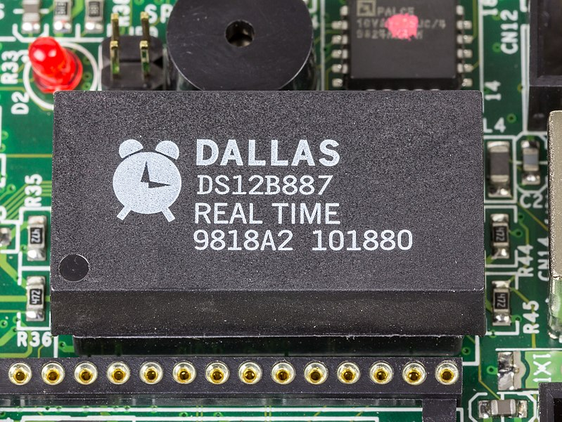

Разобраться со временем в Raspberrypi (RPi) меня сподвиг один достаточно неприятный баг. В какой-то момент моя базовая станция r2cloud просто переставала отправлять данные на сервер. В логах приложения при этом появляется следующая ошибка:

	Jun 07 09:17:51 raspberrypi java[472]: java.lang.IllegalArgumentException: Bad sample time: 1559899071. Last update time was 1559902330, at least one second step is required
	Jun 07 09:17:51 raspberrypi java[472]:         at com.aerse.core.RrdDb.store(RrdDb.java:799)
	Jun 07 09:17:51 raspberrypi java[472]:         at com.aerse.core.Sample.update(Sample.java:194)

Что же это означает? Тут нужно сделать небольшой экскурс в rrd. RRD расшифровывается как round robin database - [циклическая база данных](https://ru.wikipedia.org/wiki/Циклическая_база_данных). Новые метрики перезаписывают старые. У каждой метрики есть время и значение. Важным требованием является то, что метрики должны идти по возрастанию времени. Нельзя записать метрику 5 недель назад, так как данные 5 недель назад могли быть уже перезаписаны 1 неделю назад. Соответственно, при попытке записи метрики с некорректным временем возникает ошибка.

При создании метрики я беру текущее время:

```java
db.createSample();
...
public Sample createSample() throws IOException {
	return createSample(Util.getTime());
}
...
public static long getTime() {
    return (System.currentTimeMillis() + 500L) / 1000L;
}
```

Получается, в базе хранится метрика в будущем. Всё это указывает на явные проблемы с системным временем.

## Так как же работает время в Raspberrypi?

В RPi, а так же в различных embedded системах время работает не так, как в обычных компьютерах. В обычных компьютерах используется так называемые [часы реального времени](https://ru.wikipedia.org/wiki/Часы_реального_времени) (RTC). Это специальный чип с независимым источником питания, который постоянно увеличивает счётчик времени. Даже если отключить компьютер, эта схема будет работать и увеличивать счётчик времени. 



Вот действия при включении питания компьютера:

1. компьютер загружается
2. ядро линукса получает время от RTC
3. стартуют сетевые службы и поднимаются сетевые интерфейсы
4. стартует NTPD, который получает текущее время из интернета по протоколу [NTP](https://ru.wikipedia.org/wiki/NTP)
5. он корректирует системное время и время RTC.
6. стартуют остальные службы и процессы

Важно понимать, что RTC не является очень точным источником времени. Из-за этого на шаге 5 системные часы могут быть скорректированы. Обычно это совсем небольшая разница - секунды, редко - минуты.

В современных дистрибутивах NTPD обычно заменяют на [systemd-timesyncd](https://wiki.archlinux.org/index.php/Systemd-timesyncd_(Русский)). Эта более легковесная служба времени:

1. содержит в себе легковесный NTP-клиент
2. получает список NTP серверов по протоколу DHCP от маршрутизатора

Как же это работает в RPi? Совсем по-другому. Дело в том, что в RPi нет RTC чипа. В результате загрузка системы выглядит следующим образом:

1. RPi загружается
2. стартует служба [fake-hwclock](https://manpages.debian.org/jessie/fake-hwclock/fake-hwclock.8.en.html). Она читает текущее время из файла ```/etc/fake-hwclock.data```
3. стартуют сетевые службы и поднимаются сетевые интерфейсы
4. стартует NTPD 
5. он корректирует системное время, а fake-hwclock сохраняет текущее правильное время в файл
6. стартуют остальные службы и процессы

## Что же тут может пойти не так?

1. При самой первой загрузке в файле ```/etc/fake-hwclock.data``` лежит время сборки операционной системы
2. Если в RPi не настроена сеть, то время надо будет конфигурировать вручную
3. Если в RPi не настроена сеть и его выключить, то при следующем старте время продолжит увеличиваться с момента выключения. И если RPI будет выключен на час, значит время будет отличаться на час. Если на день, то на день.

Но не это всё стало причиной бага. Если внимательно присмотреться, то и в случае с rtc, и в случае с fake-hwclock между шагом 5 и 6 существует race condition. NTPD или systemd-timesyncd обновят время асинхронно от старта операционной системы. А это значит, приложение может получить сначала время в будущем, а потом в прошлом.

## Выводы

У этого исследования есть два вывода:

1. я знаю причину возникновения ошибки
2. мне придётся обновить документацию. Теперь я не могу утверждать, что моя базовая станция может работать без интернета. Даже если вручную сохранить последние TLE спутников, без интернета текущее время может скакать очень сильно. А это значит, нельзя будет запланировать наблюдение.
3. возможно, хорошим выходом из ситуации может стать [RTC для RPi](https://thepihut.com/blogs/raspberry-pi-tutorials/17209332-adding-a-real-time-clock-to-your-raspberry-pi)
