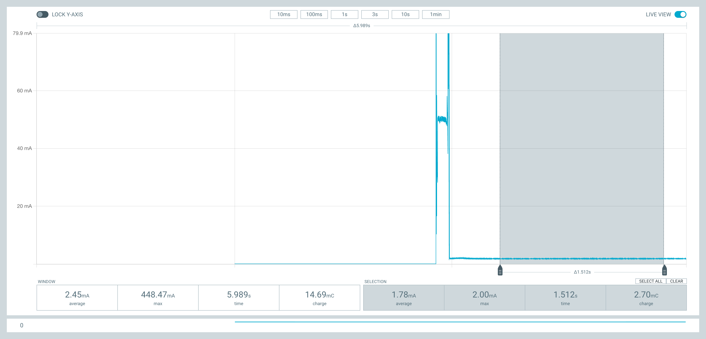
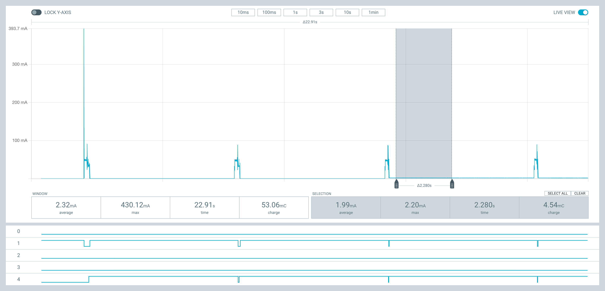

Тестируя [энергопотребление lora-at](), я обнаружил, что плата в режиме глубокого сна потребляет около 1.7мА. Это примерно в миллион раз больше, чем теоретический минимум ESP32. Такое поведение совершенно нельзя оставлять без внимания, поэтому я потратил около трёх недель, чтобы разобраться в причинах.

## Симптомы

С помощью PPK2 я установил, что после перехода в спящий режим, потребление энергии около 1.7мА:



При этом очевидно, что переход в спящий режим происходит: потребление уменьшается с ~30мА до 1.7мА. Видимо проблема где-то на самой плате.

Я также подключаю питание через JST коннектор, значит дополнительная энергия не тратится на USB-serial чипе. 

Ни один светодиод не работает, значит проблема не в них.

## Поиск проблемы

Обычно решение подобных проблем достаточно простое: первая ссылка в Google. Однако, в этот раз всё оказалось гораздо сложнее. Первая ссылка в Google ведёт на крайне [длинное и пространное обсуждение](https://github.com/Heltec-Aaron-Lee/WiFi_Kit_series/issues/6) проблемы на github. Из которого становится ясно, что:

 * Нужно явно выключить OLED экран
 * Если перепаять пару коннекторов в USB, то можно уменьшить до 4мА
 * Если в SPI протоколе пин CS (SS) в состоянии LOW (нет сигнала), то sx127x чип ожидает команду и тратит энергию
 * Меньше 1.7мА получить невозможно, так как CS пин - это не RTC пин. А значит его нельзя сделать HIGH в режиме глубокого сна
 * У кого-то получилось сделать 19мкА, но непонятно как
 * У кого-то получилось уменьшить энергопотребление выставив пинам 4-20 значение INPUT
 
Всё это крайне противоречиво, но раз у кого-то получилось, значит это теоретически возможно.

Поскольку все примеры в обсуждении были с использованием Arduino фреймворка, то я написал небольшое приложение, чтобы воспроизвести решение.

```c
if (!LoRa.begin(BAND, false)) {
	Serial.println("init failed");
}
LoRa.sleep();
SPI.end();
pinMode(SCK, INPUT);
pinMode(MISO, INPUT);
pinMode(MOSI, INPUT);
pinMode(SS, INPUT);
pinMode(15, INPUT);
pinMode(16, INPUT);
pinMode(17, INPUT);
pinMode(26, INPUT);
pinMode(14, INPUT);
esp_deep_sleep_start();
```

И на удивление оно сработало! Плата стала потреблять **~13**мкА. Значит проблема не в плате, а в моём коде.

## Дифференциальный анализ

Итак, пришло время дифференциального анализа. У меня есть две программы: одна позволяет экономить энергию, другая нет. Нужно лишь их сравнить и найти разницу. Что может быть проще?

На самом деле не всё так просто. Дело в том, что первая программа:

 * написана на С++
 * использует библиотеку LoRa.cpp, которая 
 * использует библиотеку SPI.cpp, которая
 * основана на arduino-espressif
 * собирается platformio
 
А вторая:

 * написана на С
 * использует библиотеку sx127x, которая
 * использует spi драйвер из ESP32, который
 * основан на esp-idf фреймворке
 * собирается esp-idf
 
И между ними нет ничего общего.

Дальше идёт много аналитики, поэтому слабонерным и кормящим мамам лучше не читать.

Итак, раз у нас есть две программы, в которых нет ничего общего, то это нужно исправить! Для этого я сделал программу, которая:

 * инициализирует spi драйвер
 * инициализирует чип с помощью библиотеки sx127x
 * переводит его в спящий режим
 * отключает spi шину и 
 * переходит в спящий режим
 
При этом собирал и запускал я её в platformio. В результате ошибка воспроизвелась. Плата по-прежнему потребляла 1.7мА. Из этого следует, что проблема не в языке программирования и не в инструменте сборки. Уже прогресс!

Получается проблема либо в spi драйвере, либо в [моей библиотеке](https://github.com/dernasherbrezon/sx127x). 

Следующим шагом я решил глянуть в исходники SPI.cpp и сравнить с методами ```spi_bus_remove_device``` и ```spi_bus_free```, которые ответственны за де-инициализацию spi шины.

Но здесь меня постигла неудача. Дело в том, что SPI.cpp основан на arduino-espressif. А тот работает напрямую с регистрами процессора и не использует внутри spi драйвер. В итоге я нашёл пару подозрительных мест:

 * во многих местах spi драйвера используется GPIO матрица
 * в arduino-espressif напрямую меняются регистры процессора
 
```c
...
spi->dev->pin.val = 0;
spi->dev->user.val = 0;
spi->dev->user1.val = 0;
...
```

В попытках разобраться, что такое GPIO матрица и как на уровне железа работают регистры, я потратил пару недель. Что самое обидное - это не помогло. Да, мне пришлось заглянуть в datasheet ESP32 и прочитать про GPIO matrix, да, я теперь лучше понимаю, что это такое. Но вот потребляет ли эта матрица дополнительную энергию в спящем режиме или нет, я не знаю. 
    
В какой-то момент я открыл несколько интересных вещей:

 * во-первых, пины, на которые припаяен чип sx127x, выходят наружу и их можно померить. То есть это не какие-то логические пины, которые спрятаны внутри самого микроконтроллера
 * а во-вторых, с помощью PPK2 можно померить работу протокола SPI!
 
Но и тут у меня случилась частичная неудача. Я смог посмотреть работу SPI протокола для программы на C. Выглядит, кстати, это вот так:


С помощью этого графика мне удалось увидеть, что CS пин переходит в состояние LOW в спящем режиме. Миф развеян - этот пин необязательно должен быть RTC пином.

А вот с другой стороны мне не удалось посмотреть на работу SPI протокола для С++ программы. Почему-то в arduino-espressif нельзя установить частоту шины в 50кГц. Вполне возможно это сделано для совместимости с Arduino.

В поисках идей я ещё раз прочитал даташит на sx127x, но в этот раз уделил больше внимания энергопотреблению. Там меня заинтересовала строчка: потребление тока в режиме простоя - типичное - **1.6**мА, максимальное - **1.8**мА. Выглядит, как будто, мой случай. Правда, это не сильно помогает: проблема может быть как и в неправильной работе SPI шины, так и в моём коде. Для сравнения в спящем режиме чип должен потреблять максимум **1**мкА.

В какой-то момент я понял, что сильно закопался в поиске низкоуровневых различий и решил вернуться к дифференциальному анализу.

Следующая идея заключалась в том, что в рамках одной программы поочерёдно запускать С++ код и С код. При этом каждый из них должен сначала полностью инициализировать SPI шину и чип, а потом де-инициализировать. Это позволит понять - есть ли ещё какие-то блоки или функции, которые использует С код и не выключает. Если есть, то С++ код не будет их выключать (потому что он энергоэффективный и не использует их) и потребление тока будет 1.7мА.



В итоге оказалось, что потребление всегда большое после работы С кода. Это с одной стороны хорошо, а с другой - совершенно не помогает понять, где именно проблема.

Шла третья неделя и я уже отчаялся. Я даже задал вопрос на [официальном форуме](https://www.esp32.com/viewtopic.php?f=13&t=36952). Мне никто не ответил, тогда я решил задать вопрос ChatGPT. Разумеется он мне не помог, зато я знатно посмеялся с его ответов.

Следующая идея, которая мне пришла в голову заключалась в следующем:

 * инициализировать SPI.cpp
 * инициализировать LoRa.cpp
 * де-инициализировать. Если в этот момент перейти в режим сна, то потребление будет низким
 * инициализировать spi драйвер
 * де-инициализировать spi драйвер
 * перейти в режим сна
 
Таким образом я хотел проверить, есть ли что-то внутри spi драйвера, что не выключается. Оказалось, что нет! Потребление минимальное даже после включения и выключения spi драйвера. Это значит, что проблема либо в том как spi драйвер работает с чипом, либо в моей библиотеке.

## Катарсис

Далее историки обычно пишут, что решение проблемы пришло во сне, либо в душе. Я почему-то решил, что проблема связана с чипом sx127x. Внутри моей библиотеки инициализация достаточно простая: прочитать и проверить версию чипа. А вот в С++ версии много чего:

 * проверка версии чипа
 * переход в спящий режим
 * установка частоты передачи сигнала
 * инициализация буфера для входящих/исходящих сообщений
 * инициализация LoRa - spreading factor, bandwidth, coding rate
 * и многое другое
 
 
Я решил полностью повторить все вызовы, даже если они не имеют никакого смысла. И в результате потребление энергии стало **~13**мкА! Победа! Ну а дальше было дело техники: я убирал ненужные вызовы и смотрел на потребление энергии. В итоге осталось следующее:

 * инициализация чипа
 * переход в спящий режим
 * переход в режим ожидания
 * переход в спящий режим
 
Получается, что внутри чипа есть некая логика по выключению и она срабатывает только при переходе из режима ожидания.

## Послесловие

Помимо перевода LoRa чипа в спящий режим, нужно выключить OLED экран. Для этого нужно сделать пины плавающими и отключить любые прерывания. Я написал следующую вспомогательную функцию:

```c
void disable_pin(int pin) {
  gpio_config_t conf = {
      .pin_bit_mask = (1ULL << (gpio_num_t)pin), 
      .mode = GPIO_MODE_INPUT,                   
      .pull_up_en = GPIO_PULLUP_DISABLE,         
      .pull_down_en = GPIO_PULLDOWN_DISABLE,     
      .intr_type = GPIO_INTR_DISABLE};
  ESP_ERROR_CHECK(gpio_config(&conf));
}
```

С помощью этой функции можно выключить пины sx127x и OLED экрана:

```c
disable_pin(SCK);
disable_pin(MISO);
disable_pin(MOSI);
disable_pin(SS);
disable_pin(4);
disable_pin(15);
```

В результате у меня получилось потребление энергии в режиме сна: **~13**мкА. В [статье по оптимизации]() энергопотребления для солнечной панели я брал **6**мА для режима сна. И в результате у меня получалось **656.15**Втч за день. Если же принять **~13**мкА, то получится:

```
323 мин * 16 мА + 1127 мин * 0.013 мА = 5168 мАмин + 14.65 мАмин =
= 86.37 мАч * 3.3В = 0.285 Втч
```

Если учесть, что одна солнечная панель производит **0.396**Втч, то её должно хватить на целый день!