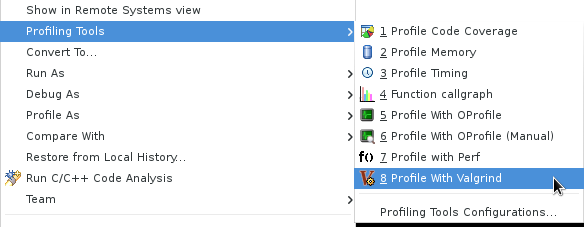
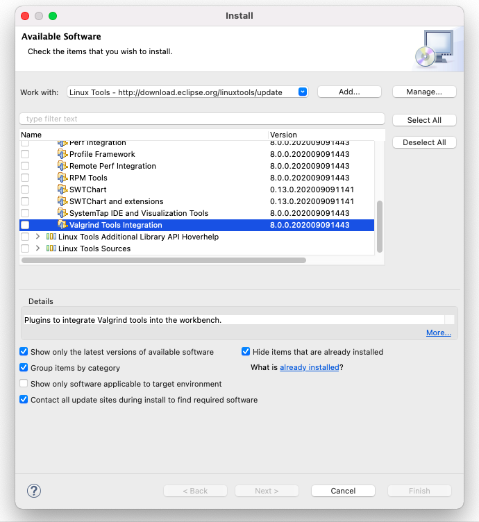
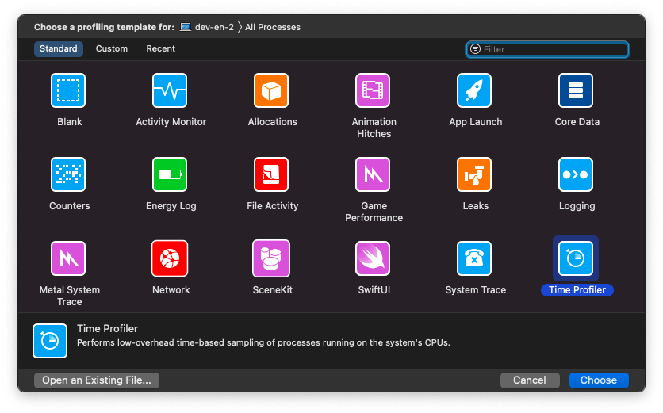
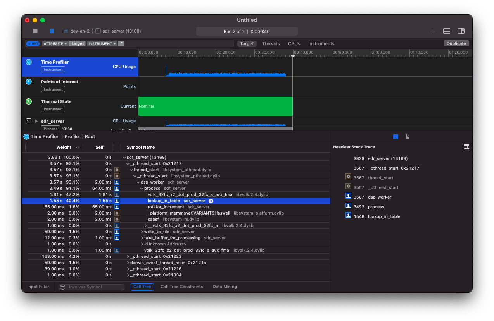
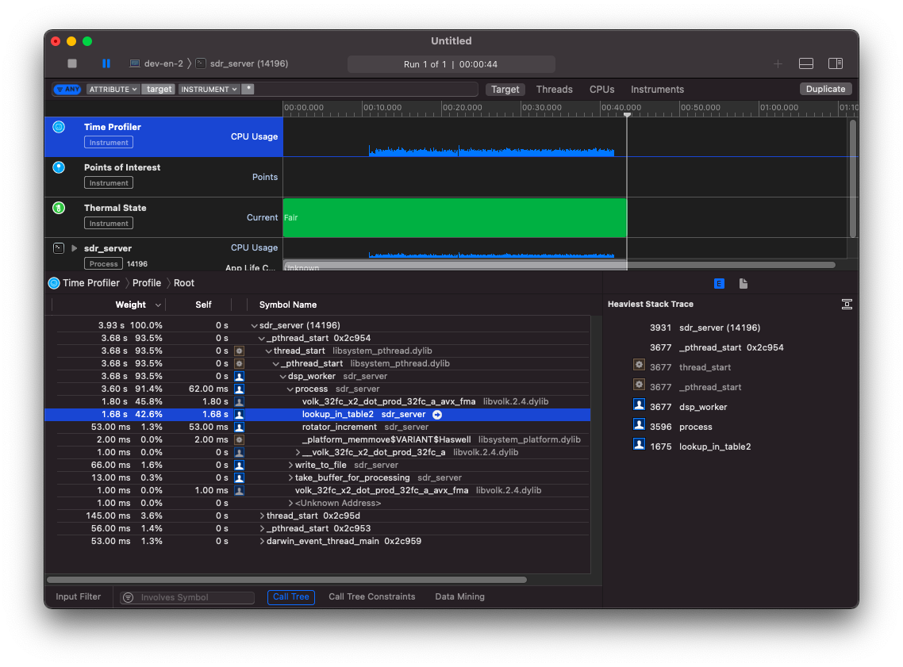
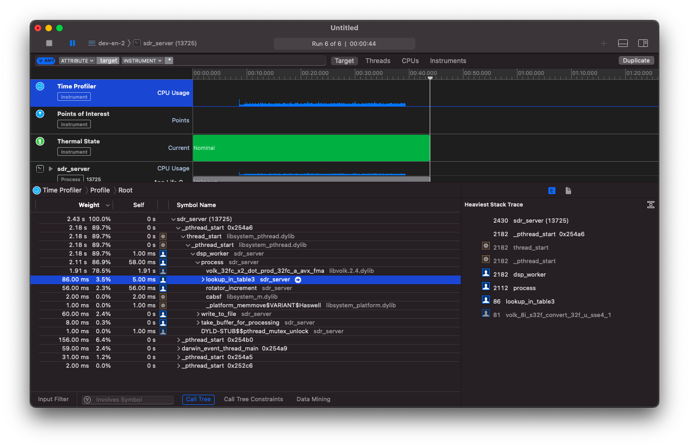

## Введение

По следам разработки моего нового проекта [sdr-server](https://github.com/dernasherbrezon/sdr-server) я решил написать очередную статью. И опять про производительность. [Прошлая статья]() закончилась удивительным результатом: использование SIMD ускоряет операцию более, чем в 2 раза. Я даже написал [небольшую программу](https://github.com/dernasherbrezon/sdr-server/blob/main/test/perf_xlating.c) для того, чтобы это проверить.

Однако, в реальной жизни тормозить может совершенно безобидный участок кода. И для того, чтобы увидеть как работает программа под реальной нагрузкой, нужно использовать [профайлеры](https://ru.wikipedia.org/wiki/Профилирование_(информатика)).

## Выбор профайлера

Оказывается, в мире Си с этим обстоит всё достаточно неплохо. Есть множество различных профайлеров на все случаи жизни:

 * [oprofile](https://oprofile.sourceforge.io/about/)
 * [gprof](https://en.wikipedia.org/wiki/Gprof)
 * [valgrind](https://www.valgrind.org)
 
Все эти профайлеры работают из командной строки. Сначала нужно скомпилировать программу в debug режиме, затем запустить с профайлером, а затем результат отобразить в ужасной ASCII графике.

К счастью, у меня есть Eclipse и в нём есть [поддержка valgrind](https://wiki.eclipse.org/Linux_Tools_Project/Valgrind/User_Guide). Можно одним кликом запустить профайлер и увидеть результаты в нормальной таблице.



Я пошёл этим путём и вскоре пожалел. 



Во-первых, под MacOS valgrind официально не поддерживается. Для этого нужно ставить стороннюю сборку через brew:

```
brew tap LouisBrunner/valgrind
brew install --HEAD LouisBrunner/valgrind/valgrind
```

Во-вторых, сторонняя сборка требует новой версии xcode 12.4. А для этого нужно его обновить. В-третьих, бинарник устанавливается в ```/usr/local/bin```, а eclipse плагин ищет его только в ```/usr/bin```. В-четвёртых, симлинки не работают:

```
sudo ln -s $(which valgrind) /usr/bin/valgrind
ln: /usr/bin/valgrind: Operation not permitted
```

Всё из-за новой политики безопасности MacOS. Даже sudo не поможет. Чтобы valgrind плагин подцепил ```/usr/local/bin```, нужно открыть текстовым редактором конфиги eclipse и прописать дополнительные пути. Ну и, в-пятых:

```
!ENTRY org.eclipse.cdt.core 4 0 2021-02-06 21:18:30.657
!MESSAGE Error: Cannot run program "valgrind": Unknown reason
!STACK 0
java.io.IOException: Cannot run program "valgrind": Unknown reason
	at org.eclipse.cdt.utils.spawner.Spawner.exec(Spawner.java:352)
	at org.eclipse.cdt.utils.spawner.Spawner.<init>(Spawner.java:94)
	at org.eclipse.cdt.utils.spawner.ProcessFactory.exec(ProcessFactory.java:99)
	at org.eclipse.cdt.core.CommandLauncher.execute(CommandLauncher.java:190)
	at org.eclipse.linuxtools.internal.profiling.launch.LocalLauncher.execute(LocalLauncher.java:40)
```

Всё это выглядит достаточно печально. Я потратил целый день, пытаясь настроить инструменты, пока не нашёл [instruments](https://en.wikipedia.org/wiki/Instruments_(software)).

## instruments

instruments - это приложение, поставляющееся с xcode. Оно позволяет профилировать запущенные процессы и поддерживает множество интересных метрик:



Работает это всё следующим образом:

 * нужно скомпилировать программу в debug режиме
 * запустить
 * запустить instruments и подсоединиться к запущенному процессу

Самые интересные метрики, наверное, time profiler и allocations. Первый собирает информацию о том, сколько времени выполняется каждый метод. А второй собирает информацию о том, где и сколько выделялось памяти. Остальные метрики, пожалуй, важны для разных приложений с GUI.

Для sdr-server наиболее важным, конечно же, является time profiler. Я написал приложение таким образом, что вся память выделяется на старте и поэтому allocations метрика не так полезна.

## Оптимизации

Я долго запрягал, но быстро ехал. Первый же запуск показал удивительную вещь:



Самый горячий участок кода - это DSP преобразования. Я ожидаемо их оптимизировал: [использовал SIMD инструкции]() и выделил в отдельный поток. Однако, профайлер показал, что там тратится только 47% времени! Остальные 40% приходятся на поиск в lookup таблице! Эта таблица используется для того, чтобы конвертировать uint8_t в float complex на интервале [-1;1]. Более детально об этом шаге я писал в недавней статье [коварные нули]().

```c
size_t lookup_in_table(const uint8_t *input, size_t input_len, xlating *filter) {
	// convert to [-1.0;1.0] working buffer
	size_t input_processed = 0;
	for (size_t i = filter->history_offset; i < filter->working_len_total && input_processed < input_len; i++, input_processed++) {
		filter->working_buffer[i] = filter->lookup_table[input[input_processed]];
	}
	return input_processed;
}
```

Получается, что поиск в такой таблице для каждого элемента занимает по времени почти столько же, сколько и умножение двух массивов float. Эта таблица достаточно небольшая - всего 256 элементов и я ожидал, что она вся попадёт в кеш процессора.

Я попробовал заменить таблицу на непосредственно вычисление:

```c
size_t lookup_in_table2(const uint8_t *input, size_t input_len, xlating *filter) {
	// convert to [-1.0;1.0] working buffer
	size_t input_processed = 0;
	for (size_t i = filter->history_offset; i < filter->working_len_total && input_processed < input_len; i++, input_processed++) {
		filter->working_buffer[i] = (input[input_processed] - 127.5F) / 128.0F;
	}
	return input_processed;
}
```



Картина не слишком поменялась. Стало даже чуть-чуть хуже.

И тут мне пришла в голову замечательная идея: а что если есть специальная функция для такого преобразования? И она нашлась: ```volk_8i_s32f_convert_32f```.  Правда, она работает чуть-чуть по-другому: она конвертирует все байты во float и умножает на число. Это как раз и создаст немного некорректное преобразование, о котором я писал в статье [коварные нули](). Скрепя сердцем я написал вот такой код:

```c
size_t lookup_in_table3(const uint8_t *input, size_t input_len, xlating *filter) {
	// convert to [-1.0;1.0] working buffer
	size_t input_processed = input_len;
	volk_8i_s32f_convert_32f_u(filter->working_buffer + filter->history_offset, (const signed char *)input, 128.0F, input_len);
	return input_processed;
}
```

Что удивительно, так это то, что мои тесты прошли! Видимо, точность, с которой я сравнивал числа была достаточной.



Ну а после запуска профайлера я увидел замечательную картину. Теперь самый горячий метод - это DSP преобразование.

## А что же дальше?

Я не ожидал, что этот участок кода будет таким медленным. Поэтому каждый dsp тред делал преобразование из uint8_t во float complex и выполнял DSP преобразование. Эта схема не очень масштабируется. Если подсоединится ещё один клиент, то он будет выполнять абсолютно такое же преобразование. Этот дизайн можно ещё улучшить, если перенести преобразование обратно на rtlsdr поток. Тогда оно будет выполняться только один раз в независимости от количества клиентов.