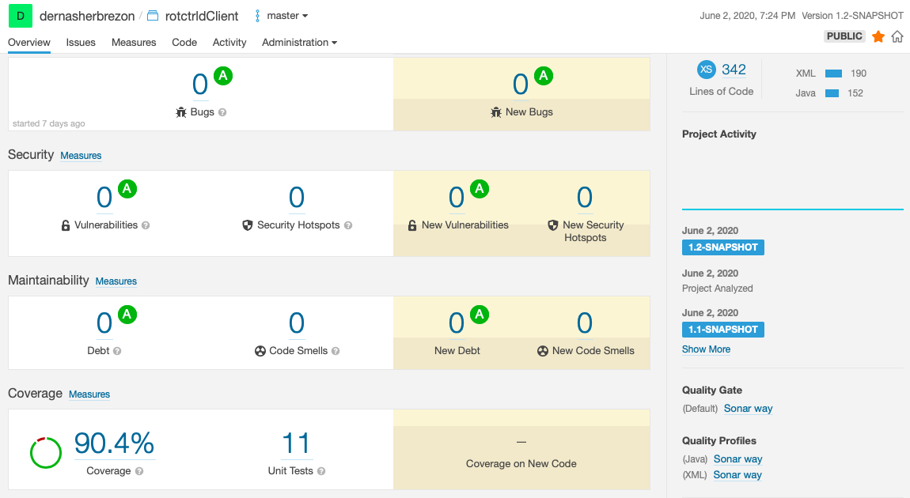
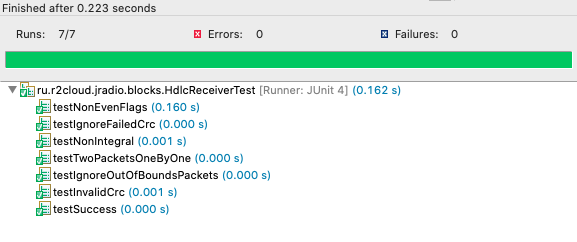
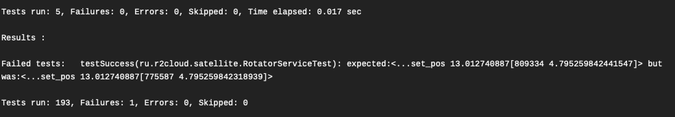

15 years ago, nobody had even heard of unit tests. We just wrote the code once and then relied on manual QA and our sharp eyes to check for any issues. We all lived in perfect harmony and peace. But then came along those damn unit tests, and suddenly the world was split into two warring factions: those who write tests and those who don't.

Spoiler alert: I'm on team auto-tests.

There are so many arguments for and against unit tests out there on the internet. So, I decided to create my own list of arguments in favor of unit tests. Because who doesn't love spending extra time writing code just to make sure it works? It's not like we have better things to do, right?

## 1

Unit tests aren't meant to test every logical condition and possible combination of inputs and outputs. They're just meant to make sure the code runs at least once.

```java
@Test
public void testSuccess() throws Exception {
	ObservationRequest req = createRequest();
	int times = (int) ((req.getEndTimeMillis() - req.getStartTimeMillis()) / 1000);
	config.setProperty("rotator.enabled", true);
	service = new RotatorService(config, predict, new ScheduleFixedTimesTheadPoolFactory(times), new SteppingClock(req.getStartTimeMillis(), 1000));
	service.start();
	assertNotNull(service.schedule(req, req.getStartTimeMillis()));
	try (BufferedReader r = new BufferedReader(new InputStreamReader(RotatorService.class.getClassLoader().getResourceAsStream("expected/rotctrld-requests.txt"), StandardCharsets.UTF_8))) {
		String curLine = null;
		int i = 0;
		while ((curLine = r.readLine()) != null) {
			assertPosition(curLine, requestHandler.getRequests().get(i));
			i++;
		}
		assertEquals(i, requestHandler.getRequests().size());
	}
}
```
I hear this conversation all the time:

- Let's write some unit tests here.
- But we won't be able to cover cases A, B, and C!
- Exactly, it's too complex and we don't have the infrastructure for it. Let's come back to it when we have more time.

I strongly disagree with this approach. Tests aren't supposed to cover every possible case, A, B, and C. Their main purpose is just to run the code at least once. I've seen so many cases where developers write code and never actually run it. Having a test is a great way to prove that the code ran at least once and that there aren't any ridiculously stupid mistakes in there. 

## 2

Even small libraries should be tested, and in fact, testing them is especially important. Often, small libraries have a clearly defined interface that can be easily tested with unit tests. It's important to ensure that even small pieces of code work correctly and reliably, as they may be used by other programs or systems and any issues could cause unexpected problems downstream. By testing even small libraries, developers can catch and fix any issues early on, before they become bigger problems.



## 3 

Writing tests makes you think about how the code is structured. Usually, a developer is focused on making sure the code works as it should. However, writing tests allows you to understand how the code will be used. I'm not a big fan of TDD, but there is some truth to this methodology - you should write code and tests at the same time. This can greatly save time on integrating the code with other components.



Also, when writing tests, you start to think: "What else can I check?" "Did I forget anything?" This allows you to look at the code from a different angle and come up with a couple of strange usage scenarios that are worth testing. This also includes all kinds of checks for input parameters and boundary conditions.

## 4

Tests allow fixing implementation errors. Suppose all tests pass successfully, but it turns out that the code still works incorrectly. In this case, its implementation is changed, and the tests are run again. There should be no errors.

This point can be expanded: tests allow updating dependent libraries. Let's say you have the situation: the code depends on a third-party library. A security flaw was found in this library. If there are tests, then you can simply update the version of the dependent library and run the tests. There should be no errors. This is very convenient to use in conjunction with automatic pull request generation systems. For example, GitHub recently learned to scan dependent libraries for various vulnerabilities and automatically create pull requests with updated library versions. If there are tests, such pull requests are automatically built and tested. If there are no errors, then you can update safely.



## Conclusion

Write tests. And if you don't know how, ask me. I know.