## Постановка задачи

 * web server - Jetty. Запускается в embedded режиме с помощью spring. Общая настройка очень похожа на http://wiki.eclipse.org/Jetty/Howto/Spring
 * IoC - spring 3.0.5
 * Servlet - собственный сервлет для роутинга запросов к обработчикам.
 * Mysql 5.5, jdbc driver 5.1.21
 * view - JSP + JSTL
 * YourKit 11
 * JMeter 2.8
 
Приложение:

 * две страницы требующие локализации.
 * первая - статичная страница (главная). Собирается из разных кусочков jsp
 * вторая - динамичная. Отображает некоторую сущность. Например, товар и его свойства.
 
Итак, для начала будем оптимизировать первую страницу. Перед тем, как начать что-то оптимизировать, необходимо померить текущее состояние, найти узкие места. Для этого необходимо сконфигурировать JMeter. Он будет симулировать пользователей, которые кликают ссылки. 

1. Скачать JMeter можно тут: http://jmeter.apache.org/
2. Запустить jmeter.sh и настроить тест:
3. Количество пользователей: 500
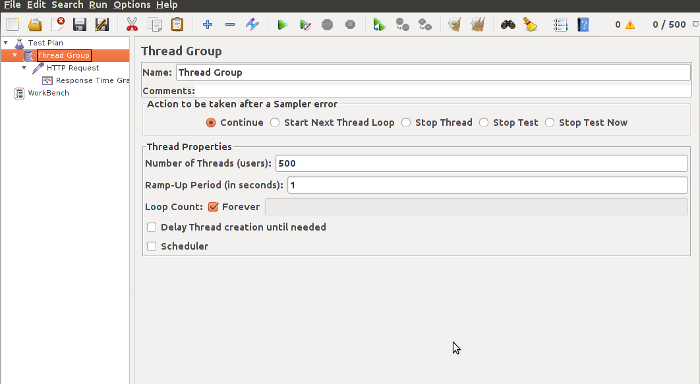
4. Настроить запрос: сервер находится по адресу localhost:8080 путь: / (главная). Так же нужно добавить http cache manager и http cookie manager, чтобы симулировать поведение реальных браузеров
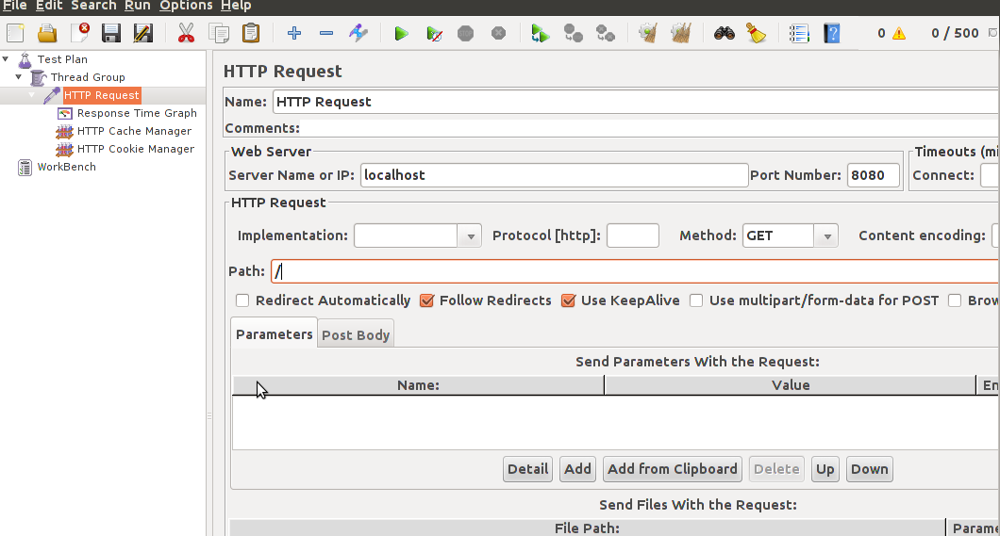

После этого, необходимо запустить jetty из под YourKit. Это очень удобно можно сделать, если использовать интеграцию с IDE. Например, Eclipse: http://www.yourkit.com/docs/12/help/eclipse.jsp. После запуска приложения, необходимо запустить JMeter на выполнение.

## Анализ данных

Первые вещи, которые бросаются в глаза это:

 * 278 потоков приложения
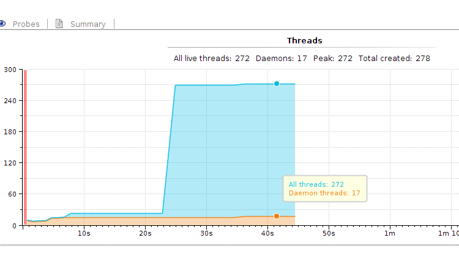
 * большой затуп всех этих ~200 потоков в самом начале
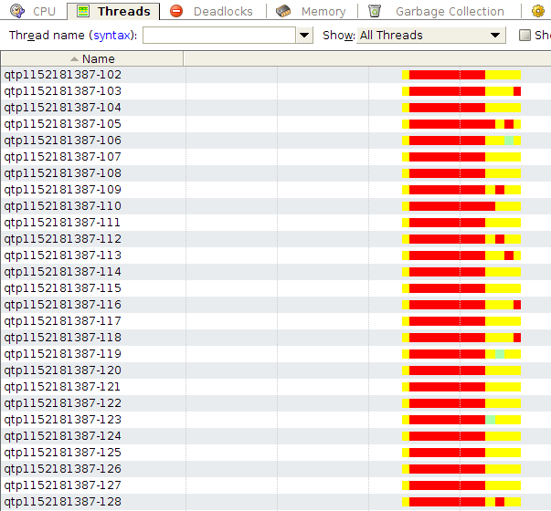

Что говорят эти графики:
 
 * Jetty сконфигурирован с использованием NIO. На каждый входящий запрос, NIO коннектор получает запрос и адресует его внутреннему threadpool'у, который и обрабатывает этот запрос (потоки с именем qtp******). Поскольку пользователей больше 200, то создаются все потоки из внутреннего пула и новые пользователи ждут пока отработает запрос предыдущих пользователей. Такая схема обработки запросов достаточно правильная, однако тут есть тонкость: не в каждой машине есть ~250 ядер. А следовательно операционная система будет тратить больше времени на переключение между этими потоками. Поэтому максимальный размер пула необходимо изменить. Хорошая формула размера пула приведена здесь: http://www.ibm.com/developerworks/library/j-jtp0730/index.html#heading6. Настроить пул можно передав в JettyServer новый ```org.eclipse.jetty.util.thread.QueuedThreadPool``` c указанным свойством maxThreads.
 * Затуп вначале связан с первичной компиляцией jsp страницы. В development среде это очень полезная вещь: можно менять jsp страницы и сервер будет автоматически показывать новую версию. В production среде, это необходимо отключить. Это можно сделать в файле webdefault.xml в Jetty. Или переопределить параметры org.apache.jasper.servlet.JspServlet в web.xml приложения. Необходимо настроить параметры: scratchdir - в эту директорию необходимо поместить скопилированные jsp и параметр development = false - jsp сервлет не будет проверять новую версию файла, из-за этого сильно увеличится быстродействие, так как не будут использоваться локи внутри сервлета.
 
После произведённых начальных оптимизаций можно посмотреть на потребляемые ресурсы. 

На рисунке ниже приведён stacktrace узкого места (performance snapshot, CPU profiling: sampling):
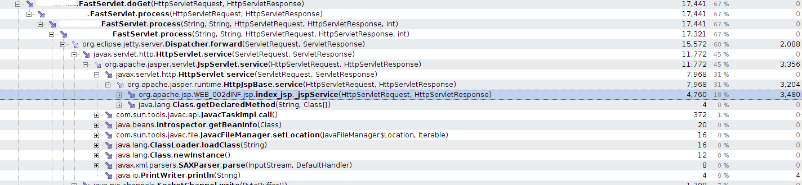

В YourKit есть специальный инструмент, который называется "Hot spots", но он выдаёт простым списком все узкие места и методы и не учитывает то, что одни узкие места вложены в другие (находятся в одном стеке вызовов). На картинке видно, что узкое место находится в index.jsp. Однако, на этой картинке не видно сколько раз вызывался этот метод и сколько времени (в среднем хотя бы) занимает обработка одного запроса. Для этого необходимо получить snapshot с использованием CPU profiling: Tracing:

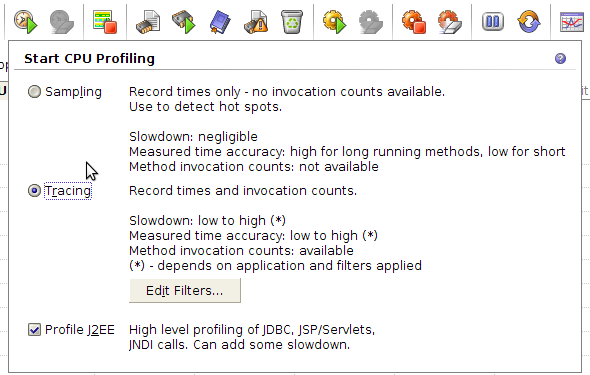

После этого можно получить snapshot с абсолютными значениями

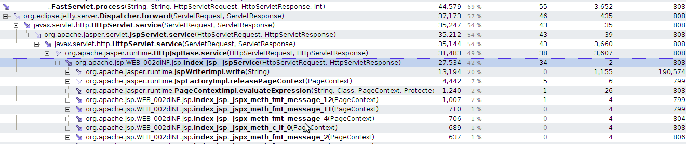

Как видно, обработка jsp страницы занимает __34ms__.

Зачем же нужны абсолютные значения? В режиме sampling YourKit выдаёт информацию об узких местах, это оптимальный способ узнать, где приложение работает медленно и при этом профайлер даёт низкий overhead. Однако для итерационной оптимизации, этот метод не очень подходит, так как необходимо понимать на сколько увеличилось или уменьшилось быстродействие после каждой оптимизации.

Как видно из картинки, всё время занимает отрисовка страницы. Как это можно оптимизировать?

 1. Если приглядеться к тому, что происходит при отрисовке, то видно, что очень много времени занимает выполнение [fmt:message](http://www.tutorialspoint.com/jsp/jstl_format_message_tag.htm). Этот тэг используется для локализации страницы. Если посмотреть код ```org.apache.taglibs.standard.tag.common.fmt.MessageSupport.doEndTag()``` то видно, что там происходит слишком много общей логики, от которой можно отказаться. Для этого необходимо сделать следующие допущения (ввести ограничения): локализация приложения не зависит от параметров запроса пользователя - это позволяет закэшировать ResourceBundle на старте приложения, используется один и тот же ResourceBundle для всех типов сообщений. После оптимизации время отрисовки страницы на сервере стало занимать: __7ms__. __Оптимизация 80%__!
 2. Кэширование. Бывает на разных уровнях. Для данной статичной страницы, можно сделать два уровня кэширования: 1. На уровне сервера - при старте страница полностью отрисовывается и помещается в кэш. При обращении пользователей, она отдаётся из кэша. 2. На уровне клиента - если пользователь запросил страницу, то браузер кэширует её и при последующем обращении отображает страницу из кэша. Поскольку наша страница статична, то её можно попробовать закэшировать. В протоколе HTTP предусмотрено множество способов кэширования данных. Очень хорошая статья про типы кэширования: http://betterexplained.com/articles/how-to-optimize-your-site-with-http-caching/. Для кэширования страницы мы будем использовать lastModifiedTime. По умолчанию в ```javax.servlet.http.HttpServlet.getLastModified()``` возвращает -1 (не использует lastModified). Какое же время необходимо возвращать на нашей странице? Поскольку у нас выключена перекомпиляция jsp на production, то новые изменения могут появится не раньше рестарта сервера. А значит lastModifiedTime можно вычислить следующим способом: на старте обработчика (сервлета) запомнить время System.currentTimeMillis()/1000 * 1000 и возвращать всегда его. После оптимизации время ответа стало занимать: __3ms__. Т.е. для пользователя, который посещает страницу второй и более раз __оптимизация 91%__.
 
Настало время посмотреть на вторую страницу, тут несколько сложнее, так как есть больше логики приложения.

Для этого необходимо указать другой путь сервлета/обработчика запроса в JMeter. Например path: "/servlet"

Изначально отрисовка страницы занимает __7ms__, так как же и для первой страницы, выполнение бизнес логики занимает __21ms__. Бизнес логика заключается в получении из базы сущности. Сущность - иерархическая, т.е. состоит из нескольких простых сущностей, каждая из которой хранится в отдельной таблице. После запуска JMeter:

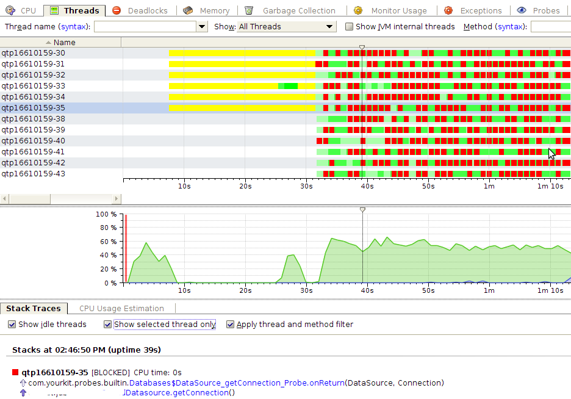

Из этой картины видно, что потоки блокируются при получении ```java.sql.Connection``` из ```org.apache.commons.dbcp.BasicDataSource```. Это происходит из-за того, что для обработки одного запроса несколько раз вызывается ```datasource.getConnection``` и ```conn.close()``` - т.е. соединение берётся и кладётся в пул. Это можно оптимизировать, если использовать ThreadBoundDatasource. Как он работает?

 1. Он реализует интерфейс ```java.sql.Datasource``` и работает поверх ```org.apache.commons.dbcp.BasicDataSource```
 2. При получении запроса, в методе doGet он получает соединение и кэширует его для этого потока. Например, с помощью ThreadLocal.
 3. При любом обращении datasource.getConnection() он возвращает это соединение.
 4. Бизнес логика не закрывает соединение, оно закрывается на выходе из doGet.
 
Алгоритм достаточно простой, но для большого приложения, где есть очень много сервлетов, контроллеров и простых потоков, реализовать и поддерживать его достаточно сложно: нужно не забывать получать и возвращать соединение в пул.

Реализовать этот алгоритм можно двумя способами:

 1. С использованием aop (aspect oriented programming) и aspectj. Для этого необходимо создать аннотацию, например, ```@ThreadBoundDatasource(readOnly=false)``` и пометить ею метод сервлета. Создать аспект, который будет создавайть соединение перед методом с этой аннотацией, а затем возвращать соединение после выполнения метода. У этого подхода есть недостатки: aspectj генерирует очень много мусора и как оказалось выигрыш в производительности не даёт (увеличивает время выполнения на ~1ms), создание Proxy объекта не позволяет посмотреть stacktrace в YourKit.
 2. Ручное добавление логики к каждому из сервлетов. Из недостатков можно отметить рутинность операции и большую вероятность ошибок для большого проекта.
 
После реализации алгоритма, график стал выглядеть следующим образом:

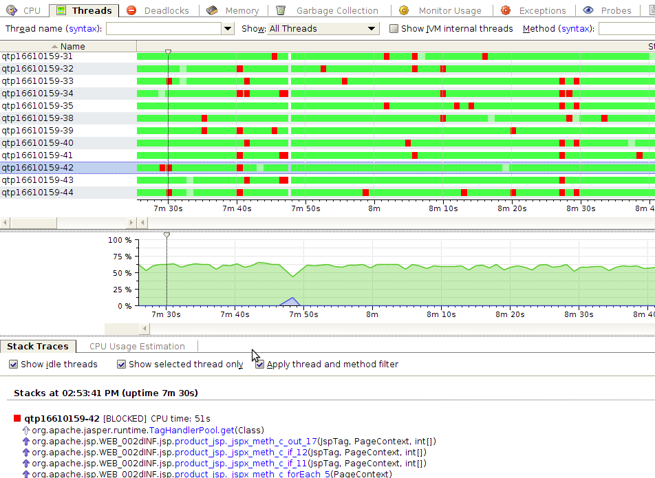

Время обработки запроса стало __16ms. Оптимизация 20%__

Как видно потоки больше не ждут соединения, или ждут но очень мало времени, так что YourKit не успевает это отобразить. Из блокировок остались блокировки на пуле тэгов. Небольшое исследование показало, что есть пул PerThreadTagHandlerPool, но в нём есть утечки памяти и его использование не рекомендовано: https://issues.apache.org/bugzilla/show_bug.cgi?id=43790

На следующим этапе оптимизации встала задача внедрения кэширования результатов запросов к базе данных. Performance snapshot показал, что узкое место приложения - это запрос к базе данных. Так же исходя из графика потребления памяти видно, что генерируется очень много мусора (~600Mb), который можно сократить если переиспользовать объекты:

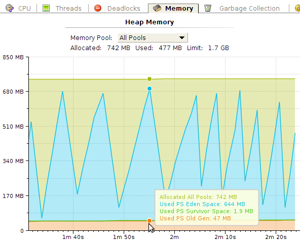

YourKit имеет замечательный UI на котором можно посмотреть сколько времени потрачено на сборку мусора и как при этом работали потоки:

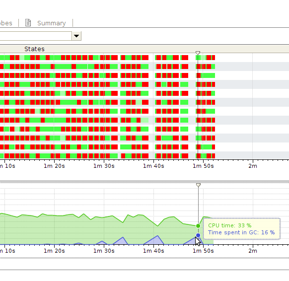

Белая область в работе потоков означает stop-the-world, когда останавливаются все потоки приложения и выполняется сборка мусора. Как видно, со временем сборка мусора начинает занимать больше времени.

Для кэширования использовалась библиотека [Ehcache](http://ehcache.org/).

После введения кэширования для некоторых объектов, время обработки бизнес логики стало составлять __9ms__. Что в сумме даёт __оптимизацию 57%__.

В YourKit есть замечательная метрика: количество и типы Exception'ов и stacktrace мест, где они были вызваны. Генерация Exception - это очень ресурсоёмкая операция. Поэтому генерацию обычно стараются избегать в высоконагруженных приложениях. При запуске performance теста, данная метрика выдала следующую картину:

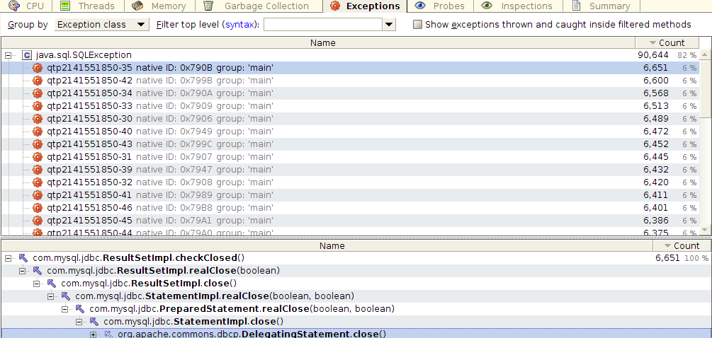

Оказывается драйвер кидает SQLException при закрытии курсора, и проглатывает (не обрабатывает) его. На каждый запрос к базе кидается несколько SQLException. Это баг самого драйвера: http://bugs.mysql.com/bug.php?id=67318. После того, как этот баг пофиксят, ожидается серьёзный прирост в производительности.

## Выводы

 1. Современные фреймворки позволяют быстро разрабатывать приложения, но есть место для их оптимизации.
 2. Настройки по умолчанию не всегда оптимальны для нагруженных проектов.
 3. Даже проекты проверенные временем, не всегда оптимизированы под быстродействие.
 4. Многоуровневое кэширование очень сильно разгружает сервер и увеличивает быстродействие.
 5. Кэширование сократило объём генерируемого мусора, но серьёзных изменений не произошло, кривая роста мусора в памяти лишь немного стала пологой. Видимо есть ещё места, в которых генерируется мусор.