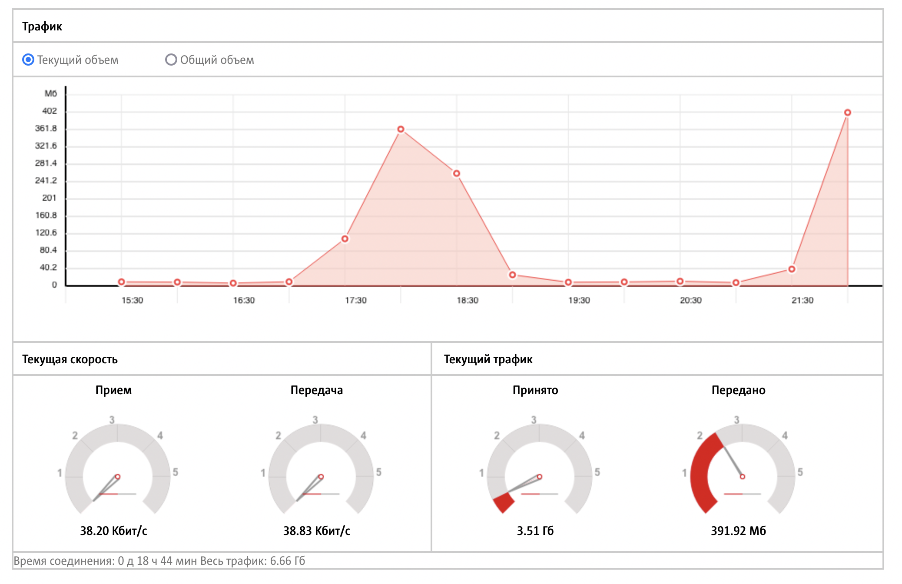
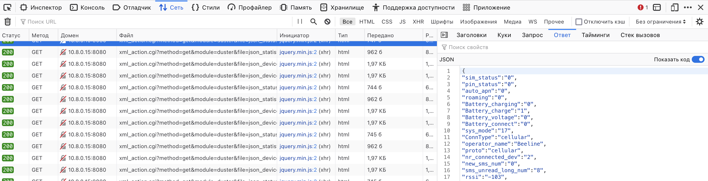
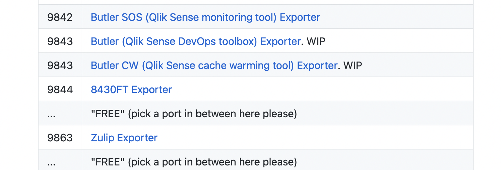
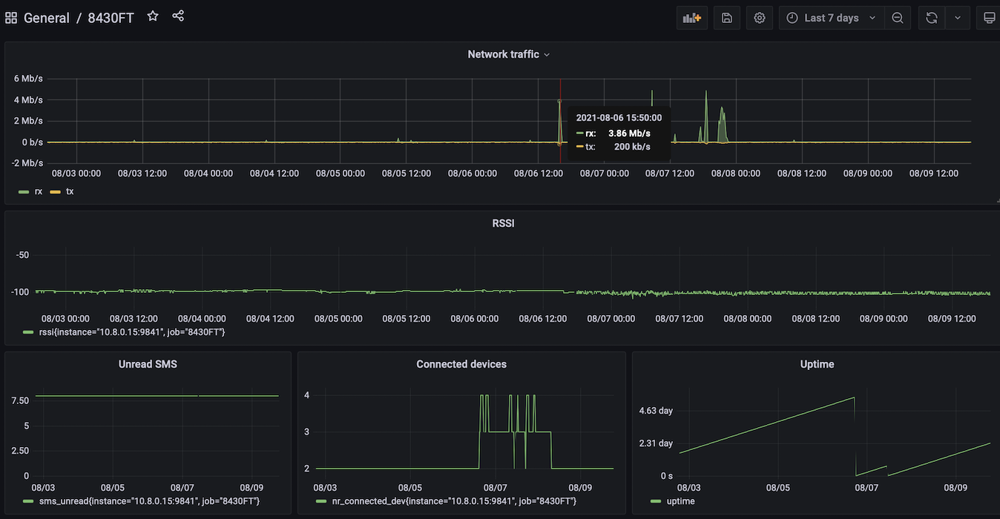

Prometheus - база данных для хранения метрик. Туда можно записать метрики производительности системы, [роутеров](), Java-приложений и многое другое. Если приложение не поддерживает протокол Prometheus для экспорта метрик, то можно взять один из [готовых exporter'ов](https://github.com/prometheus/docs/blob/master/content/docs/instrumenting/exporters.md). Exporter - это небольшой прокси сервер, который берёт метрики из приложения в одном формате и выдаёт метрики в Prometheus формате. Но что, если готового exporter'а нет? Не беда - его можно написать!

## 8430FT

8430FT - это LTE-модем, который может раздавать интернет через Wi-Fi. Важной особенностью этого модема является возможность подключить внешнюю антенну. Это особенно актуально в удалённых местах, где базовые станции находятся далеко. Используя большую направленную антенну можно очень хорошо усилить сигнал.


8430FT - это совсем небольшой модем в формате USB стика, который можно воткнуть в компьютер или напрямую в USB блока питания. Если зайти в админку, то можно найти несколько графиков и статус работы модема. Это хорошо, так как метрики точно доступны в модеме и каким-то образом их можно получить.



Эти графики нарисованы неплохо, но если присмотреться, то возникает несколько вопросов. Например, почему скорость изображена в виде спидометра? Для автомобилей - это стандарт, а вот для скорости интернет соединения этот способ не очень подходит. Какая будет максимальная скорость? Модем может подключиться как к 4G, так и 3G. У них разные скорости и непонятно как рисовать спидометр. Даже на скриншоте видно, что стрелки находятся всегда на нуле, несмотря на то, что трафик идёт.

8430FT - не выдаёт информацию через SNMP. Это очень плохо, потому что придётся писать свой собственный Prometheus exporter, а не использовать готовый [snmp_exporter](https://github.com/prometheus/snmp_exporter). С одной стороны понятно: 8430FT - пользовательское устройство и только самые отъявленные гики будут его мониторить с помощью промышленных решений. С другой, дать хоть какой-нибудь доступ на устройство можно было бы. Хотя бы для отладки web интерфейса.

Я попробовал найти хоть бы какие-нибудь открытые порты на 8430FT и нашёл только два:

 * 80 - для админки
 * 6666 - какой-то health check сервис. На любое текстовое сообщение он возвращает в текстовом виде "OK". А может быть это бэкдор компании Fareli limited, которая произвела это устройство.
 
Внутри модема используется операционная система [nucleus RTOS](https://en.wikipedia.org/wiki/Nucleus_RTOS). Забавный факт, но ничего полезного он не дал.

Если открыть web developer console, то в запросах можно увидеть следующее:



Для получения статуса устройства и статистики используется json-подобный протокол. Ну хоть html не придётся парсить. Протокол получается даже ещё проще, так как каждый запрос содержит в себе токен digest аутентификации. И этого знания о протоколе достаточно, чтобы написать exporter.

## 8430ft_exporter

Следующим шагом будет выбор языка, на котором можно написать exporter. Дело в том, что сам Prometheus написан на Go и большинство exporter'ов написаны на нём же. В принципе, можно написать на любом языке. Главное, чтобы это был web-сервис, который бы выдавал метрики в особом текстовом формате. К счастью, для Java существует официальная библиотека, которая сильно упрощает написание таких сервисов.

```xml
<dependency>
	<groupId>io.prometheus</groupId>
	<artifactId>simpleclient_httpserver</artifactId>
	<version>0.11.0</version>
</dependency>
```

После того как она подключена нужно реализовать некий Collector:

```java
public class ModemCollector extends Collector {
	@Override
	public List<MetricFamilySamples> collect() {
		...
	}
}
```

На каждое обращение, он будет делать запрос к модему по http, парсить и возвращать метрики в списке ```List<MetricFamilySamples>```.

Далее, надо будет зарегистрировать этот Collector в глобальном registry метрик:

```java
collector.register();
```

И поднять web-сервер, который подцепит этот registry:

```java
new HTTPServer(host, port, true);
```

Далее можно уже сфокусироваться непосредственно на самих метриках. Не все метрики одинаково полезны. Например, 8430FT может выдавать метрики curUpSpeed и curDnSpeed. Скорость аплоада и скачивания соответственно. Их удобно вывести в web интерфейсе, но импортировать в Prometheus не имеет смысла. На каком интервале измерялась скорость? Это количество байт отправленных за последнюю секунду или среднее количество байт отправленных за последнюю минуту? Обычно такие метрики вычисляются во время отрисовки графиков. Если пользователь выбрал такой интервал, что один пиксель соответствует одной секунде, значит надо взять количество байт в секундном интервале и поделить на длину интервала. А если пиксель соответствует 5 минутам, то нужно брать все байты отправленные в течение минуты и делить на минуту. Тогда скорость бит/с будет правильно высчитываться в обоих случаях.

Команда Prometheus написала [неплохой гайд](https://prometheus.io/docs/instrumenting/writing_exporters/) о том, как правильно писать exporter, какие метрики стоит экспортировать и как правильно давать им имена.

После того как модуль написан, его можно анонсировать, сделав pull request к [странице документации](https://github.com/prometheus/docs/blob/master/content/docs/instrumenting/exporters.md). Также можно зарезервировать порт для нового exporter'а на [специальной странице](https://github.com/prometheus/prometheus/wiki/Default-port-allocations). Несмотря на то, что порты можно задавать извне, очень удобно иметь множество различных exporter на одной физической машине с портами по-умолчанию.



## Результат

В результате у меня получился небольшой проект - [8430ft_exporter](https://github.com/dernasherbrezon/8430ft_exporter). Он может экспортировать метрики модема, на основе которых можно собрать вот такой дашборд:



Параметр RSSI сигнала очень полезный - он позволяет оценить качество 4G антенны и её направление. А вместе со скоростью интернета позволяет понять зависимость скорости от уровня сигнала. 